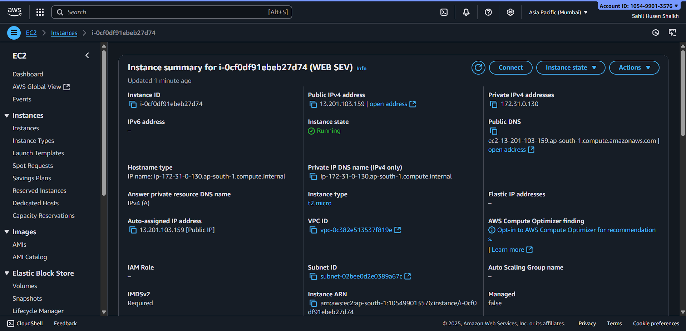
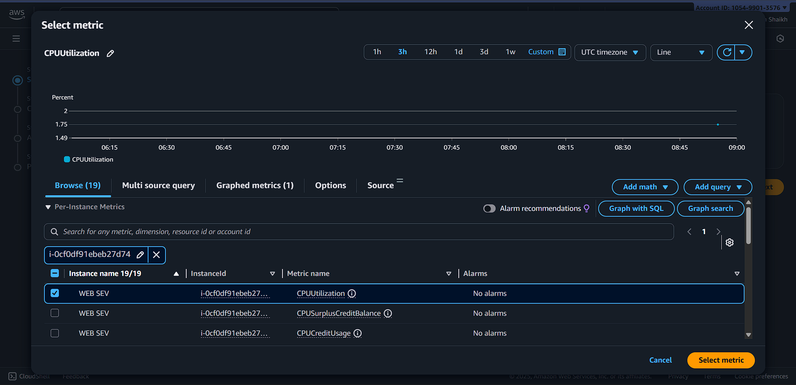
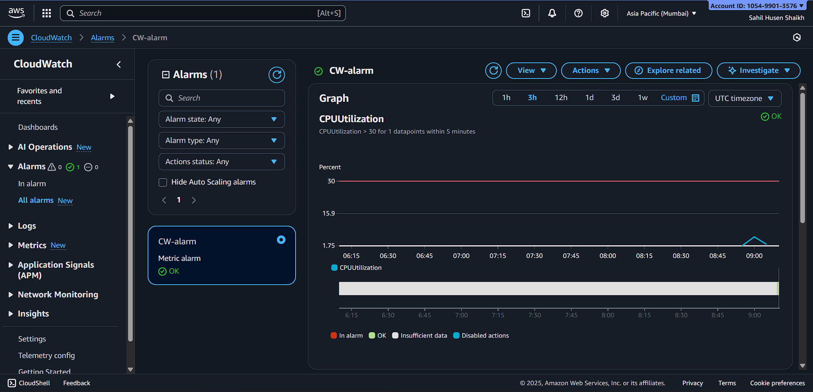
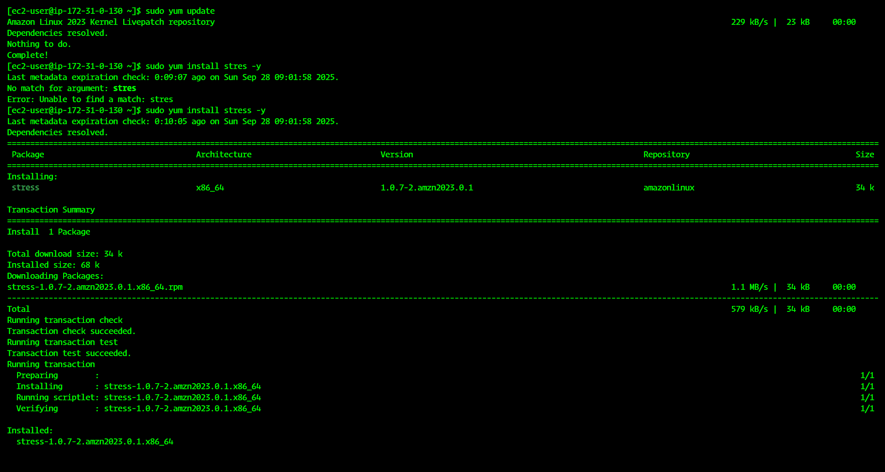
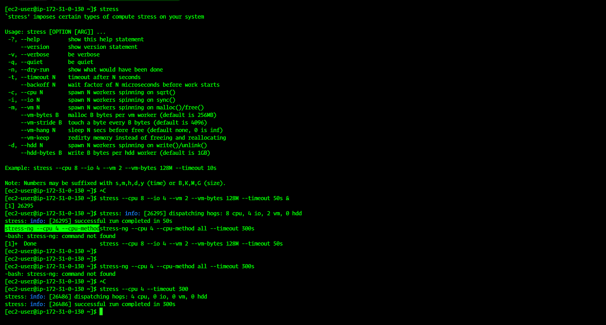
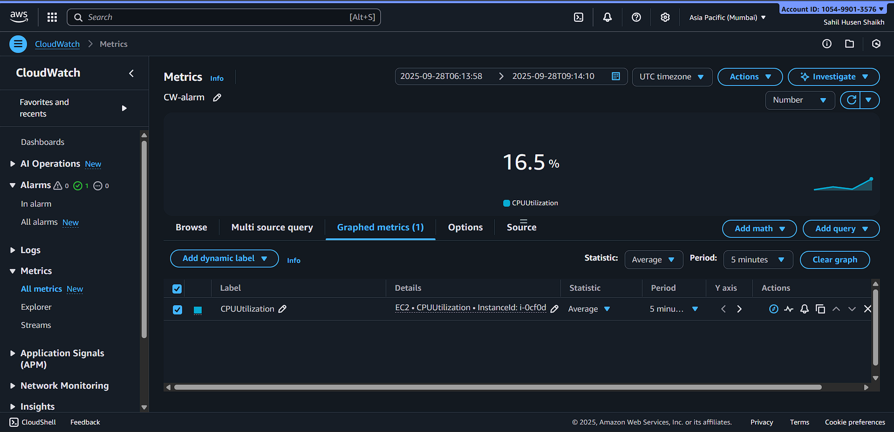
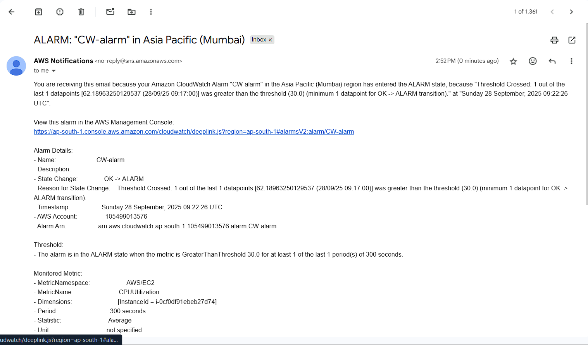
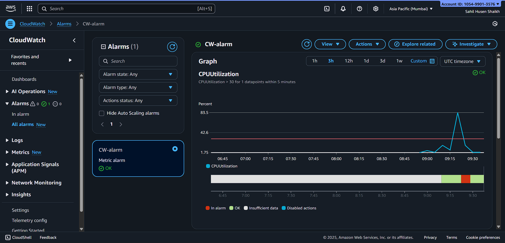

# 📊 AWS CloudWatch – CPU Monitoring & Stress Test

## 📌 Overview

This guide demonstrates how to:  

- Monitor **EC2 instance CPU usage** with CloudWatch  
- Set up **CPU utilization alarms**  
- Simulate CPU load using **stress** command  

> ⚠️ **Security Reminder:** Do **not** include any AWS credentials in public repositories. Always use placeholders.

---

## 🪜 Step-by-Step Implementation

### 1️⃣ Set Up CloudWatch Alarm

1. Navigate to **AWS Console → CloudWatch → Alarms → Create Alarm**  
2. Select the **EC2 instance** and choose **CPUUtilization** as the metric  
3. Set threshold: **≥ 50%**  
4. Configure **actions** (optional): send notification via SNS  

💡 **Tip:** Give a **clear alarm name** for easy identification.

---

### 2️⃣ Simulate CPU Load

1. Connect to the **EC2 instance** via SSH:  
```bash
ssh ec2-user@<instance-public-ip>
```
---
Install stress tool:

Copy code
```
# Amazon Linux
sudo yum install -y stress
```
- Generate CPU load on 4 cores for 5 minutes:
---
# Copy code
```
stress --cpu 4 --timeout 300
```

> 💡 Tip: Monitor CloudWatch → Metrics → CPUUtilization while stress is running. You should see the CPU spike.

---

## 3️⃣ Verify CloudWatch Alarm

# Go to CloudWatch → Alarms

- Check if the alarm changes state when CPU usage exceeds threshold

- Ensure notifications (SNS) are triggered if configured

---

### 🎯 Expected Outcome
> ✅ CloudWatch alarm triggers when CPU exceeds threshold

> ✅ EC2 instance metrics show CPU spikes during stress test

> ✅ Ability to monitor and respond to CPU load automatically

---

📂 Reference Screenshots 

## 🖼️ Reference Screenshots

<p align="center">
  
  
  
  
  
  
  
</p>

<p align="center">
  
  
  
  
  
  
  
</p>

---

🌐 Connect with Me
LinkedIn: https://www.linkedin.com/in/sahilshaikh867/

Portfolio: https://sahilshaikh867.vercel.app/

--------------------------------------------------------------Created By Sahil Shaikh----------------------------------------------------------------------
