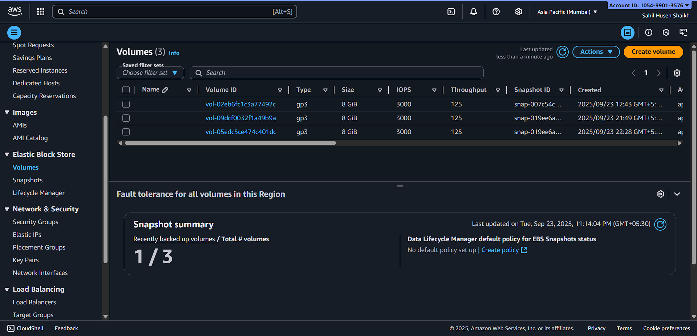
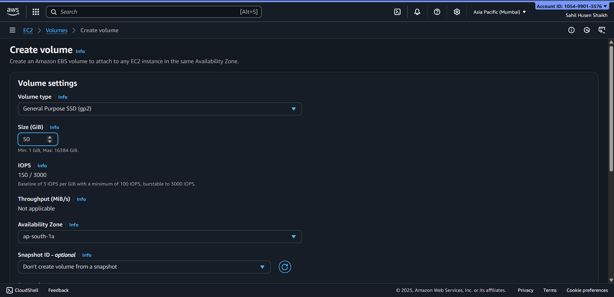
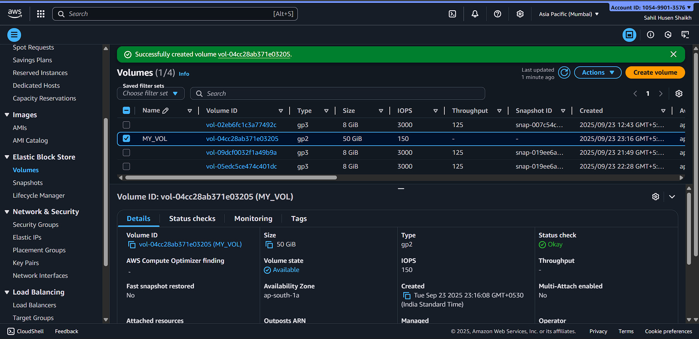
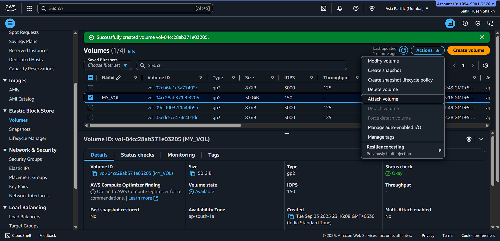
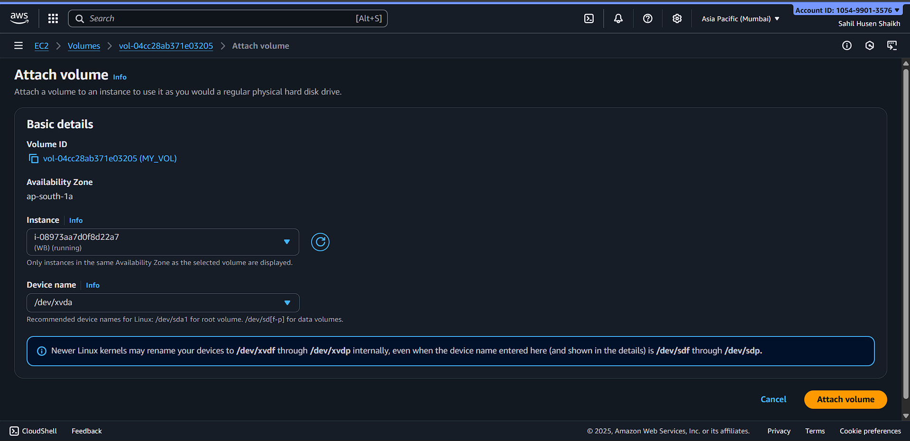
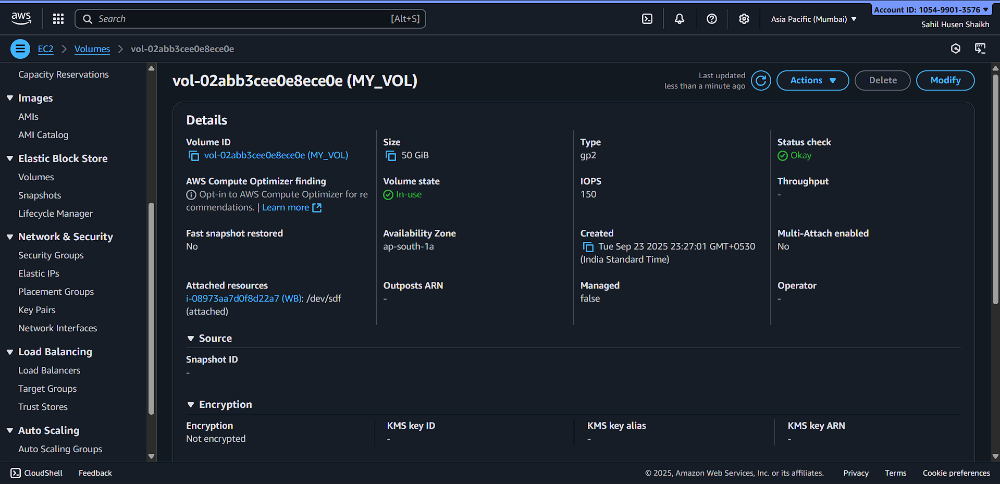
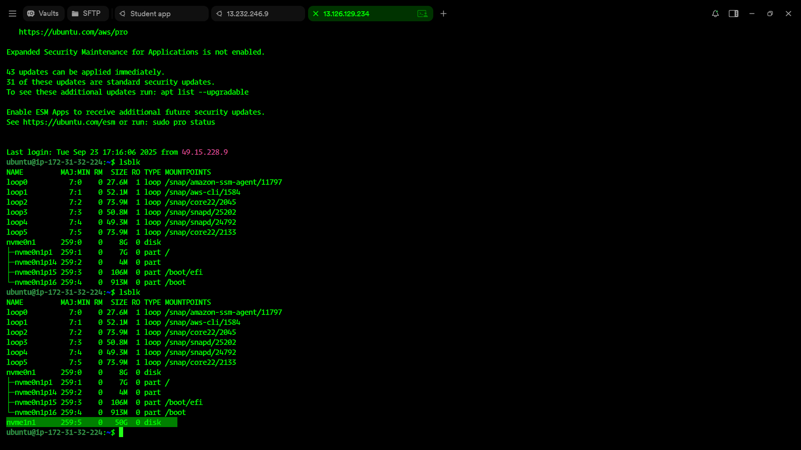
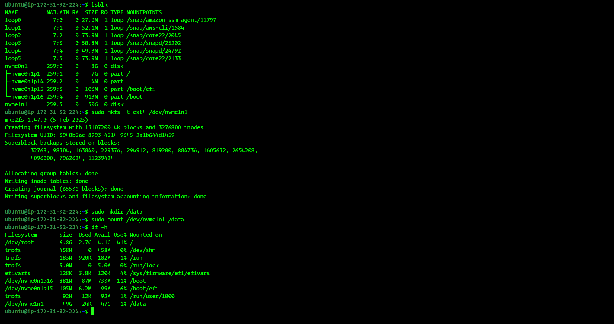

# 💾 Task 4: Create & Mount EBS Volume to EC2 Instance

## 📌 Overview
This guide explains how to:  
- Create a new **EBS Volume** in AWS  
- Attach it to an **existing EC2 instance**  
- Mount and format the volume inside the instance  

> ⚠️ **Security Note:** Always ensure the EBS volume is in the **same Availability Zone (AZ)** as your EC2 instance.

---

## 🪜 Step-by-Step Guide

### 1️⃣ Create a New EBS Volume
- Go to **EC2 Console → Elastic Block Store → Volumes**  
- Click **Create Volume**  

📸 

- Choose:  
  - **Volume type:** gp2 (General Purpose SSD)  
  - **Size:** as per requirement (e.g., 5 GiB)  
  - **Availability Zone (AZ):** same as your EC2 instance  
- Click **Create Volume** ✅
📸 

--- Check the newly created volume

📸 

---

### 2️⃣ Attach Volume to EC2 Instance
- Select the newly created volume  

📸 

- Click **Actions → Attach Volume**  
- Choose the target **EC2 instance**  
- Note the **device name** (e.g., `/dev/sdf`)

📸 

📸 

---

### 3️⃣ Verify Volume in EC2 Instance
- Connect to your EC2 instance via SSH  
- Run the following command to list block devices:

📸  

📸  

```bash
lsblk
```
---

### 4️⃣ Format the Volume
## Format the attached volume with ext4 filesystem:
```bash
sudo mkfs -t ext4 /dev/xvdf
```
---

### 5️⃣ Mount the Volume

## Create a directory to mount the volume:
```bash
sudo mkdir /data
```
---

## Mount the volume:
```
sudo mount /dev/xvdf /data
```

## Verify it’s mounted:
```
df -h
```
---

### 🎯 Outcome

- ✅ New EBS volume created

- ✅ Attached to EC2 instance

- ✅ Formatted and mounted successfully

- ✅ Configured for persistence across reboots (optional)
---
### 📂 Repository Structure Suggestion

```
Task-Volume-Mount/
├── README.md        <-- This detailed guide
└── screenshots/
    ├── step1-create-volume.png
    ├── step2-attach-volume.png
    ├── step3-lsblk.png
    ├── step4-format.png
    ├── step5-mount.png
    └── step6-fstab.png
```
----
###💡 Best Practices:
- Always make sure the EBS volume is in the same AZ as the EC2 instance.
- Use descriptive mount points (e.g., /data, /backup).
- Take snapshots of important volumes regularly for backup.
                         
--------------------------------------------------------------Created By Sahil Shaikh-----------------------------------------------------------------------------
