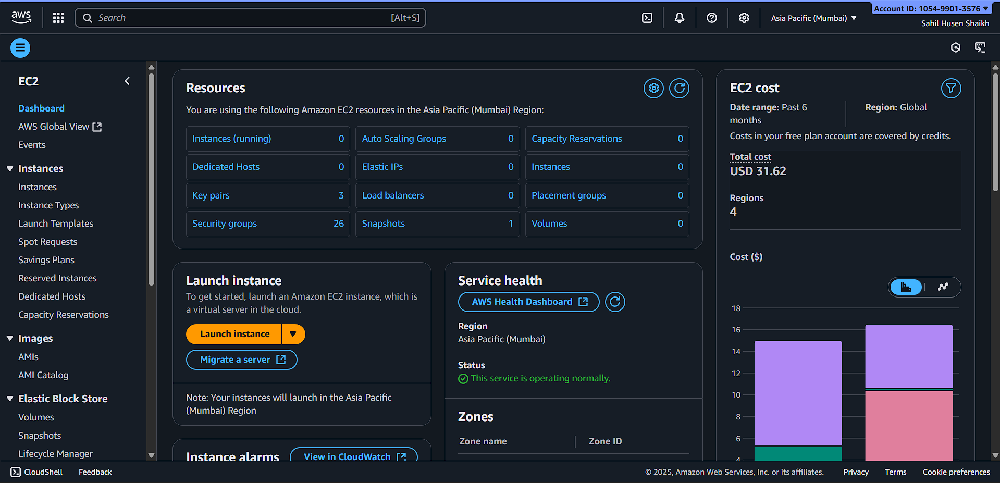

# 🔑 EC2 Access Recovery (Lost Key Pair)

## 📌 Overview
This guide explains how to **recover SSH access** to an EC2 instance if the **key pair is lost**.  

You will use a **Recovery Server** (EC2 instance with working SSH access) to regain access to the **Lost Key Server**.  

> ⚠️ **Security Note:** Never share your private keys publicly. Use placeholders or generate new key pairs for tutorials.

---

## 🪜 Step-by-Step Recovery Guide

### Scenario
- **Lost Key Server:** EC2 instance with lost SSH key  
- **Recovery Server:** EC2 instance with working SSH access  
- **Goal:** Restore SSH access to Lost Key Server using Recovery Server

---

### 1️⃣ Stop the Lost Key Server
- Go to **EC2 Console → Instances**  
- Select **Lost Key Server**  
- Click **Stop**  

> Reason: Safely detach the root volume for recovery

📸 

---

### 2️⃣ Detach Root Volume from Lost Key Server
- Navigate to **Volumes → Select Lost Key Server root volume → Detach**  
- Ensure the volume status is **available**

📸 

---

### 3️⃣ Attach Volume to Recovery Server
- Recovery Server must be in the **same Availability Zone**  
- Attach volume as secondary (e.g., `/dev/sdf`)  

AWS CLI example:
```bash
aws ec2 attach-volume \
  --volume-id <LOST_VOLUME_ID> \
  --instance-id <RECOVERY_INSTANCE_ID> \
  --device /dev/sdf
