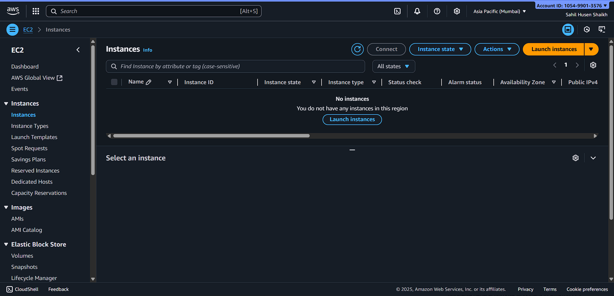
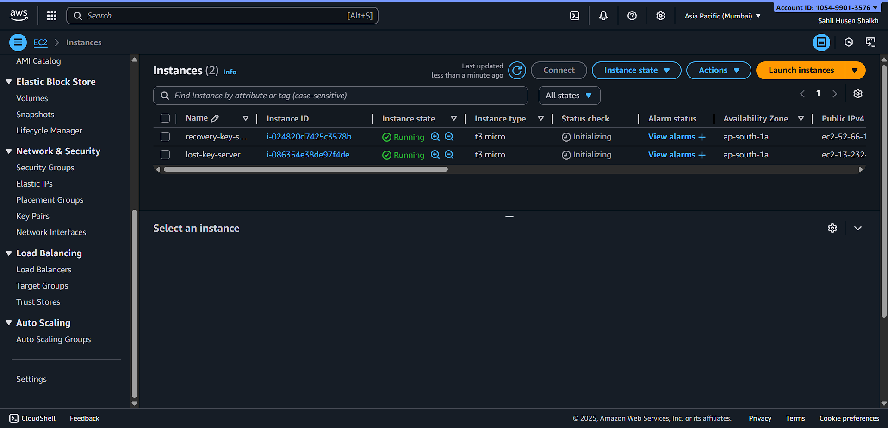
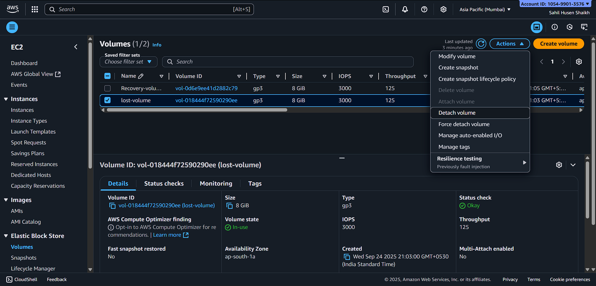
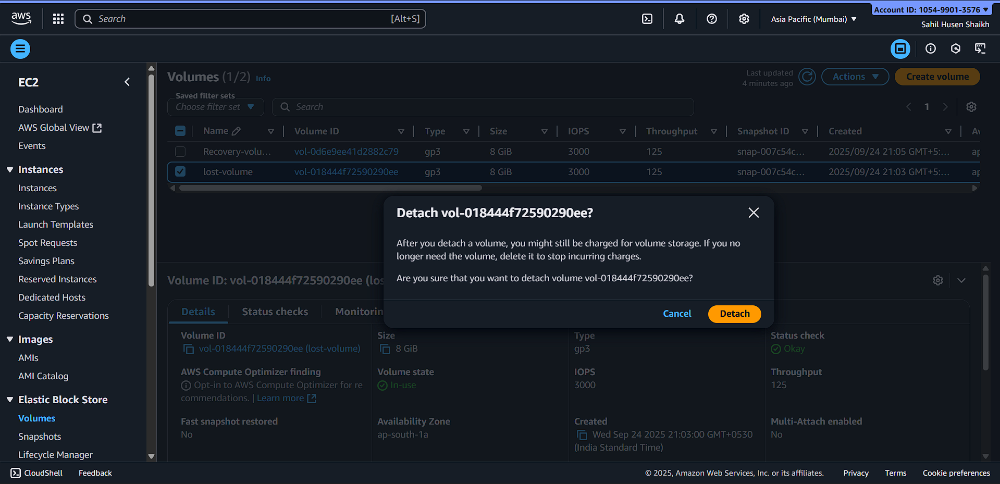
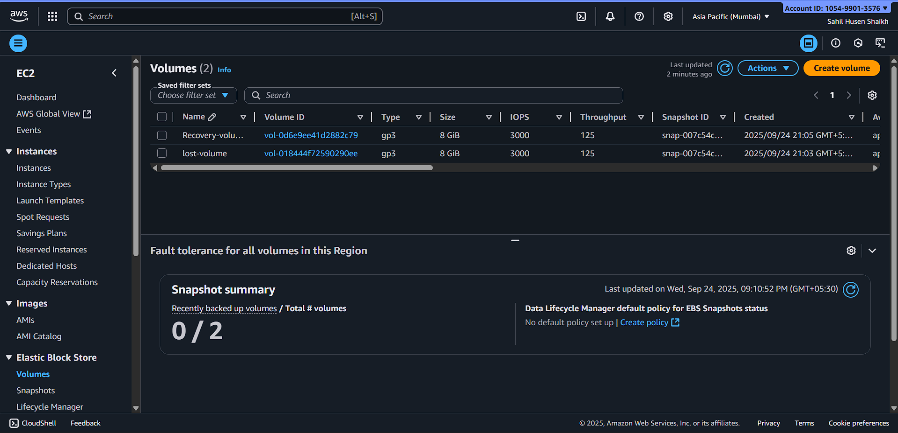
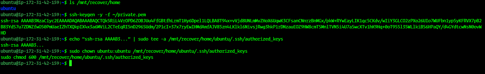

# 🔑 EC2 Access Recovery (Lost Key Pair)

## 📌 Overview
This guide explains how to **recover SSH access** to an EC2 instance if the **key pair is lost**.  

You will use a **Recovery Server** (EC2 instance with working SSH access) to regain access to the **Lost Key Server**.  

> ⚠️ **Security Note:** Never share your private keys publicly. Use placeholders or generate new key pairs for tutorials.

---

## 🪜 Step-by-Step Recovery Guide

### Scenario
- **Lost Key Server:** EC2 instance with lost SSH key  
- **Recovery Server:** EC2 instance with working SSH access  
- **Goal:** Restore SSH access to Lost Key Server using Recovery Server

---

### 1️⃣ Stop the Lost Key Server
- Go to **EC2 Console → Instances**  
- Select **Lost Key Server**  
- Click **Stop**  

> Reason: Safely detach the root volume for recovery

📸 

📸 

📸 

---

### 2️⃣ Detach Root Volume from Lost Key Server
- Navigate to **Volumes → Select Lost Key Server root volume → Detach**  
- Ensure the volume status is **available**

📸 

📸 

---

### 3️⃣ Attach Volume to Recovery Server
- Recovery Server must be in the **same Availability Zone**  
- Attach volume as secondary (e.g., `/dev/sdf`)

📸 

AWS CLI example:
```bash
aws ec2 attach-volume \
  --volume-id <LOST_VOLUME_ID> \
  --instance-id <RECOVERY_INSTANCE_ID> \
  --device /dev/sdf
```
---

### 4️⃣ Login to Recovery Server
```
ssh -i ~/recovery-key.pem ubuntu@<RECOVERY_SERVER_IP>
```
---

## Fix permissions if needed:

```
chmod 600 ~/recovery-key.pem
```
---

📸

### 5️⃣ Mount the Lost Volume

## Create mount point:

```
sudo mkdir -p /mnt/recover
```

## Check devices:
  
```
lsblk
```

## Mount the lost volume:

```
sudo mount /dev/nvme1n1p1 /mnt/recover
```

---

## Verify contents:

```
ls /mnt/recover/home
```
---
### 6️⃣ Generate Public Key from Recovery PEM

```
ssh-keygen -y -f ~/recovery-key.pem
```

- Output:

```
ssh-rsa AAAAB3NzaC1yc2EAAAADAQABAAABAQC...
```
---

### 7️⃣ Add Recovery Key to Lost Server

- Append public key to authorized_keys of Lost Server:

```
echo "ssh-rsa AAAAB3..." | sudo tee -a /mnt/recover/home/ubuntu/.ssh/authorized_keys
```

---

## Fix ownership and permissions:

```
sudo chown ubuntu:ubuntu /mnt/recover/home/ubuntu/.ssh/authorized_keys
sudo chmod 600 /mnt/recover/home/ubuntu/.ssh/authorized_keys
```

---

📸

### 8️⃣ Unmount Volume

```
sudo umount /mnt/recover
```

📸

### 9️⃣ Detach from Recovery Server & Reattach to Lost Server

- Detach the volume from Recovery Server

- Reattach it as root volume (/dev/sda1) of Lost Key Server

📸

### 🔟 Start the Lost Key Server

## Go to EC2 Console → Start Lost Key Server

## SSH using the Recovery Key:

```
ssh -i ~/recovery-key.pem ubuntu@<LOST_SERVER_IP>
```

---

📸

### 🎯 Outcome

- ✅ SSH access restored for Lost Key Server

- ✅ Original data remains safe and intact

- ✅ Recovery method is non-destructive

- 💡 Notes & Tips
---

## Always backup authorized_keys before editing:

```
sudo cp /mnt/recover/home/ubuntu/.ssh/authorized_keys /mnt/recover/home/ubuntu/.ssh/authorized_keys.bak
```
---
### Final Commands Like This
  

📸 Step 2:   

📸 Step 3: 

📸 Step 4:  

📸 Step 5: 

📸 Step 6: 

📸 Step 7: 

- Ensure correct permissions on .ssh directory and authorized_keys

- Use AWS Systems Manager (SSM) for keyless recovery in future

### 📂 Suggested Repository Structure
```
Task-EC2-Recovery/
├── README.md        <-- This detailed guide
└── screenshots/
    ├── step1-stop.png
    ├── step2-detach.png
    ├── step3-attach.png
    ├── step4-ssh.png
    ├── step5-mount.png
    ├── step6-keys.png
    ├── step7-umount.png
    ├── step8-reattach.png
    └── step9-ssh.png
```

