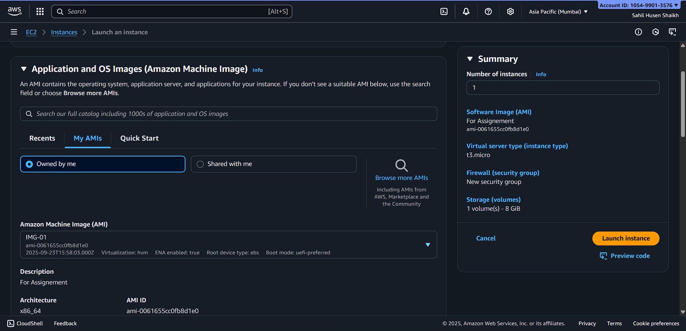
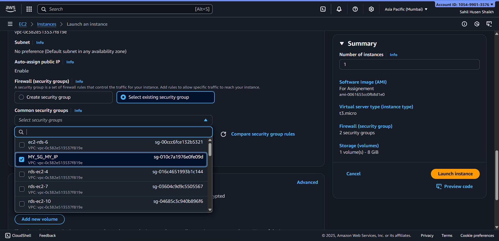
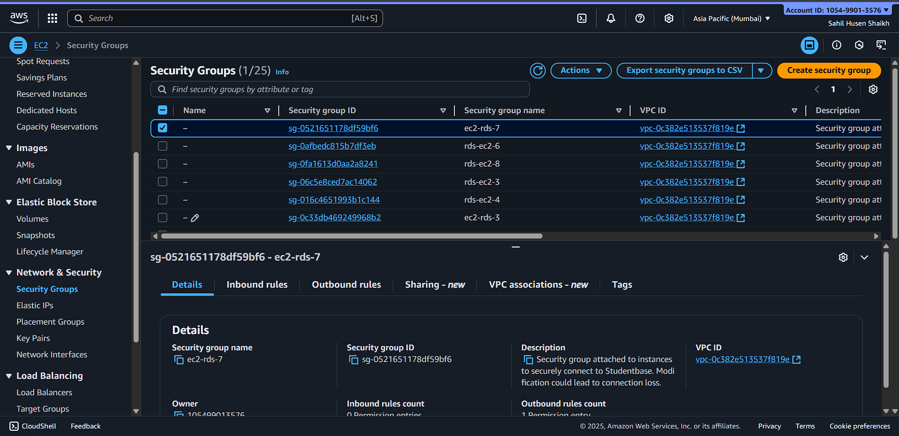
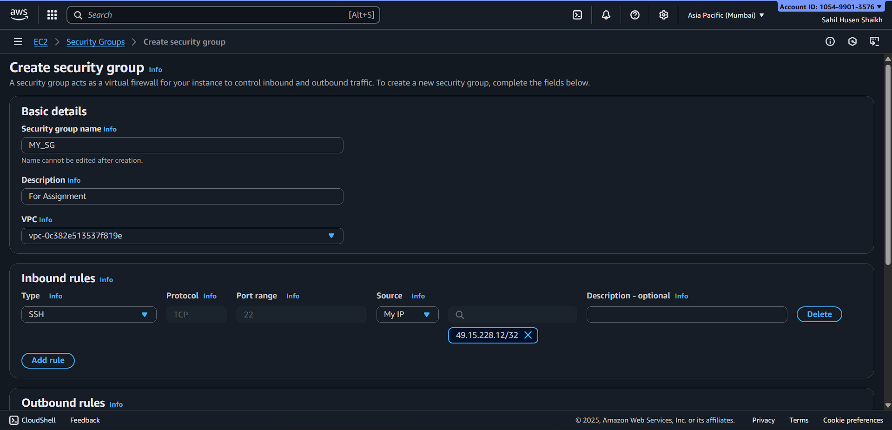
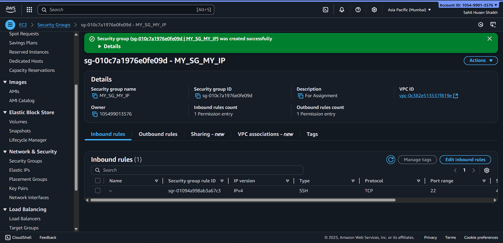
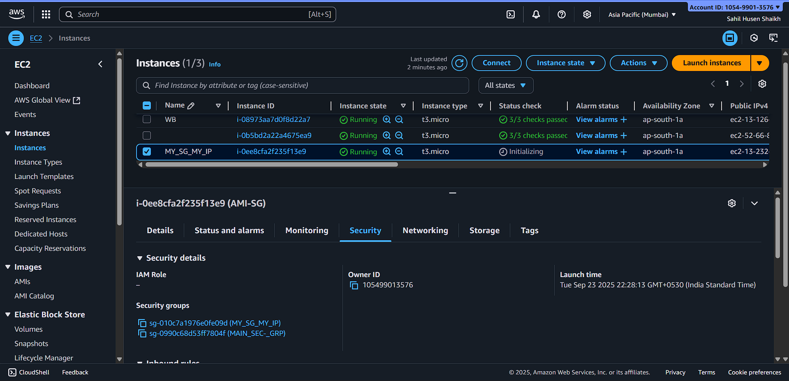
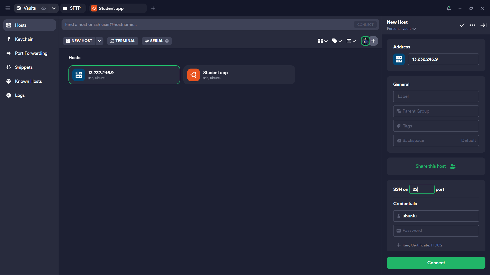
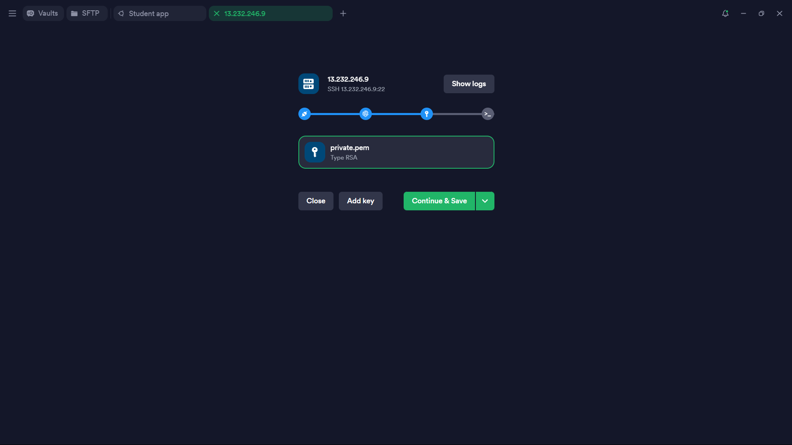
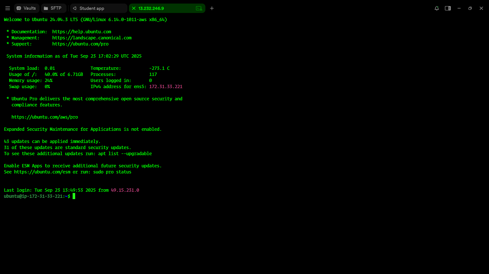

# 🛡️ Task 3: Launch EC2 with Custom Security Group (Only Your IP)

## 📌 Overview
This guide walks you through creating a **new EC2 instance** with a **custom security group** that allows SSH access **only from your IP address**.  

> ⚠️ **Security Note:** Limiting SSH access to your IP enhances security and reduces exposure to unauthorized access.

---

## 🪜 Step-by-Step Guide

### 1️⃣ Launch a New EC2 Instance
- Go to **EC2 Console → Instances → Launch Instances**  
- Select **AMI** and **Instance Type** as required  
- Click **Next: Configure Instance**  

📸 

📸 

---

### 2️⃣ Configure Security Group
- Choose **Create new security group**  
- Enter a **name** and **description**  
- Add **Inbound Rule → SSH → My IP**  
- This ensures only your current IP can access the instance  

📸 

> 💡 **Tip:** Always check your IP before adding it to the rule. You can find it using `https://whatismyipaddress.com/`.

---

### 3️⃣ Launch EC2 Instance
- Attach the **custom security group** created in the previous step  
- Review all settings  
- Click **Launch**  
- Choose an existing **key pair** or create a new one for SSH access  

📸 

> ⚠️ **Reminder:** Keep your key pair safe. Without it, you won’t be able to SSH into the instance.

---
### Security-Group

📸 

### 4️⃣ Verify SSH Access
- Open terminal or your preferred SSH client  
- Run:  (Termius)

📸 

📸 

---

## USE SECURITY KEY (Which used when Instance Create)

📸 

### Finally Worked

📸 

```bash
ssh -i "your-key.pem" ubuntu@<Public-IP-of-EC2>
