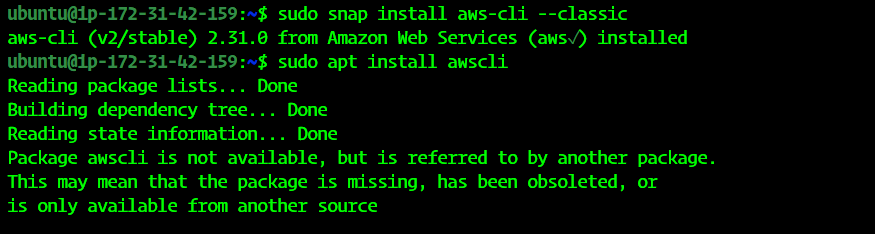
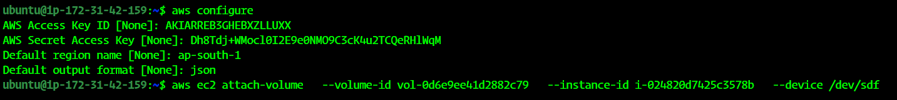
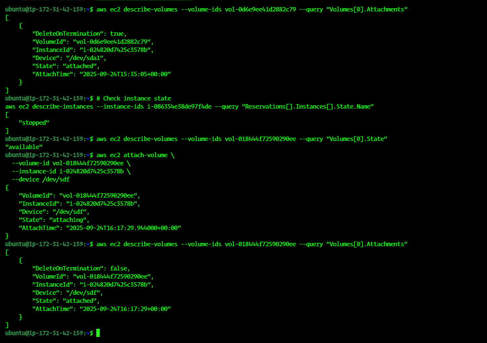
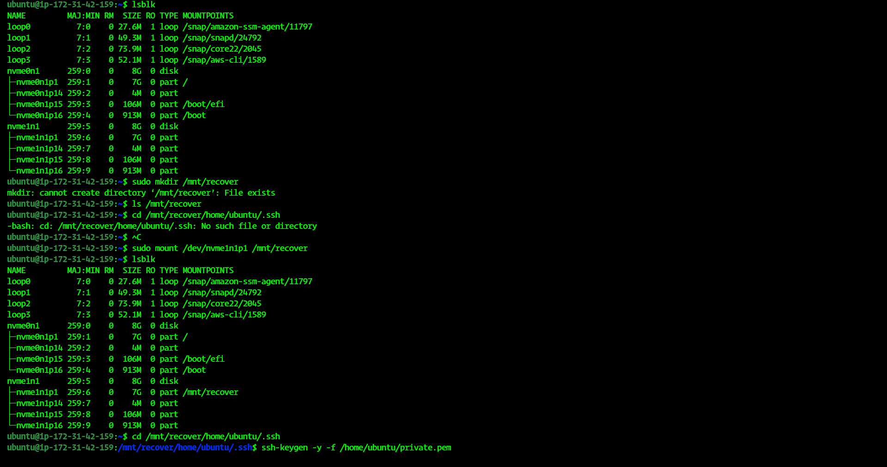
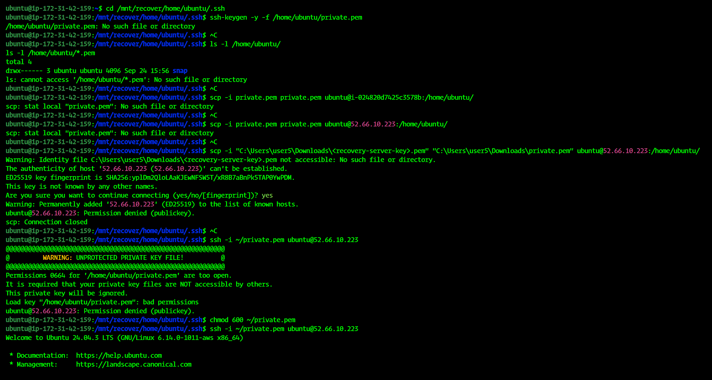
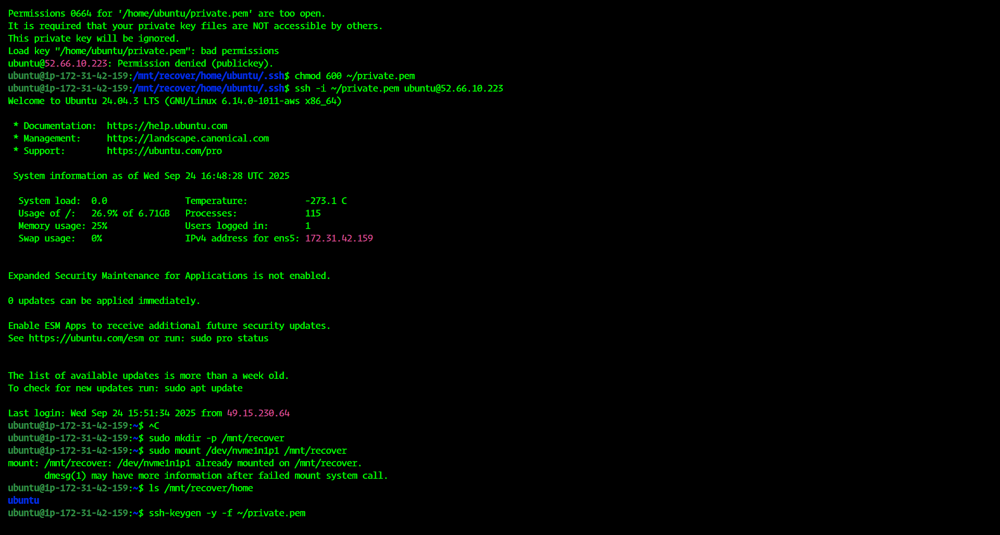

# 💾 Task: Take EBS Snapshot & Restore New Volume

## 📌 Overview
This guide walks through:  
- Taking a **snapshot** of an existing EBS volume  
- Restoring a **new volume** from that snapshot  
- Attaching and mounting the restored volume to an EC2 instance  

> ⚠️ **Security Note:** Never include real AWS credentials in public repositories. Always use placeholders.

---

## 🪜 Step-by-Step Guide

### 1️⃣ Select EC2 Instance
- Navigate to **EC2 Console → Instances**  
- Identify the instance whose volume you want to snapshot  

📸 

---

### 2️⃣ Identify EBS Volume
- Go to **Volumes → Select the attached volume**  
- Note **Volume ID** and **Availability Zone**  

📸 

---

### 3️⃣ Create Snapshot
- Click **Actions → Create Snapshot**  
- Provide a **name** and optional **description**  
- Click **Create Snapshot** ✅  

📸 

> ⏳ Snapshot creation may take a few minutes depending on the volume size.

---

### 4️⃣ Verify Snapshot
- Navigate to **Snapshots**  
- Ensure snapshot status is **Completed**  

📸 

---

### 5️⃣ Restore New Volume from Snapshot
- Select snapshot → **Actions → Create Volume**  
- Configure **size, type, Availability Zone**  
- Click **Create Volume**  

📸 

---

### 6️⃣ Attach New Volume to EC2
- Go to **Volumes → Select new volume → Actions → Attach Volume**  
- Choose **Target EC2 Instance** and **Device Name** (e.g., `/dev/sdf`)  

📸 

---

### 7️⃣ Mount the Volume on EC2
```bash
sudo mkdir -p /mnt/ebs
sudo mount /dev/nvme1n1 /mnt/ebs
ls /mnt/ebs
