# 🚀 AWS CLI Setup & IAM User Configuration

## 📌 Overview
This guide explains how to:  
- Install **AWS CLI on Ubuntu**  
- Create an **IAM user with CLI-only access**  
- Generate **Access Keys**  
- Configure AWS CLI  
- Verify setup using EC2 commands  

---

## 🪜 Steps Performed

### 1️⃣ Install AWS CLI on Ubuntu
Ran the following commands:

```bash
sudo snap install aws-cli --classic
aws --version
sudo apt update
sudo apt install unzip -y
unzip awscliv2.zip
sudo ./aws/install
```

### 2️⃣ Open AWS Console & Search IAM
- Logged in to **AWS Console**  
- Searched for **IAM** service  

📸 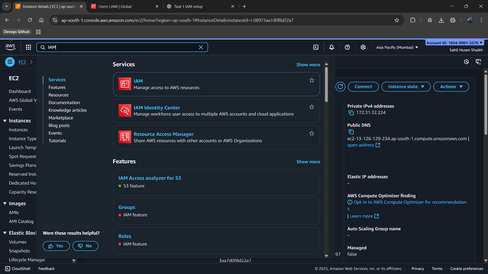

---

### 3️⃣ IAM Dashboard → Users
- Opened **IAM Dashboard**  
- Navigated to **Users** section  

📸 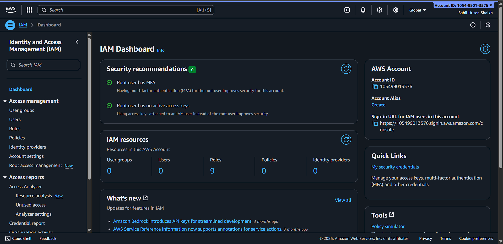

- Check User List
  
📸 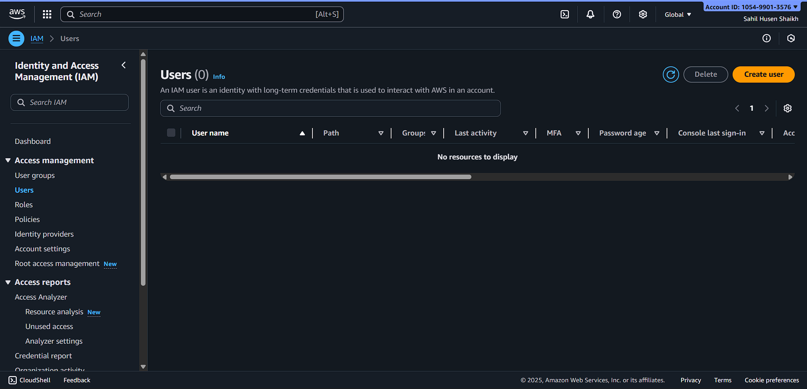

---

### 4️⃣ Create New IAM User
- Clicked **Add User**  
- Entered username
  
📸 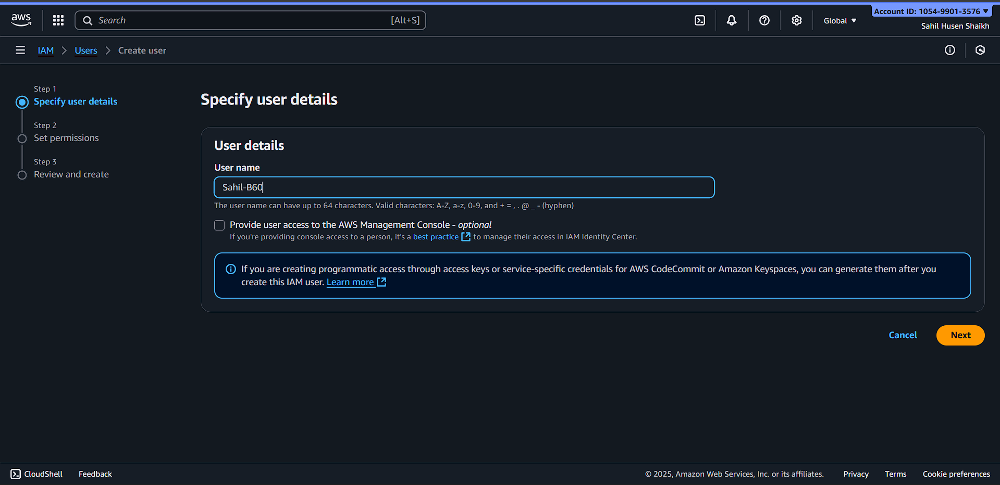
   
- Unticked **Provide AWS Management Console access**
- Selected **Attach policies directly** and assigned permissions  

📸 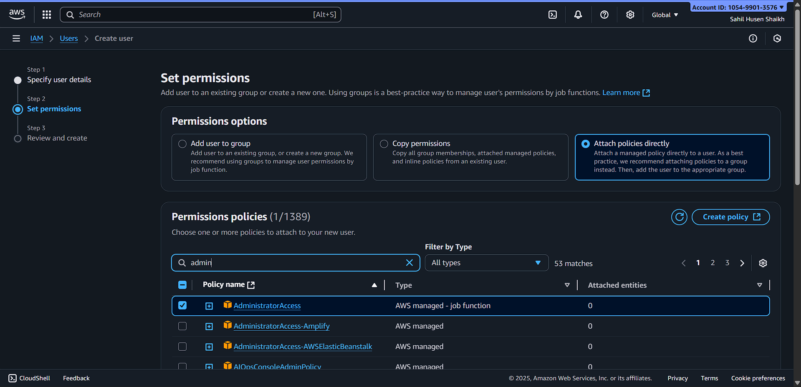

---

### 5️⃣ Review & Create User
- Reviewed configuration  
- Created IAM user successfully ✅  

📸 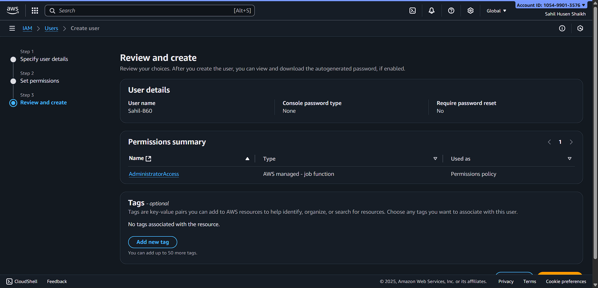

- Confirm User are created or Not

📸 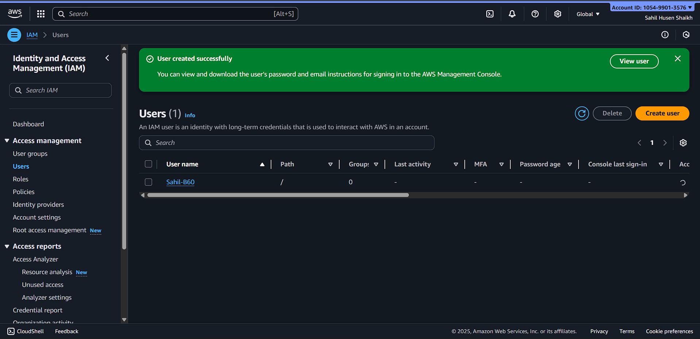

---

### 6️⃣ Generate Access Key
- Went to **Security Credentials**
  
📸 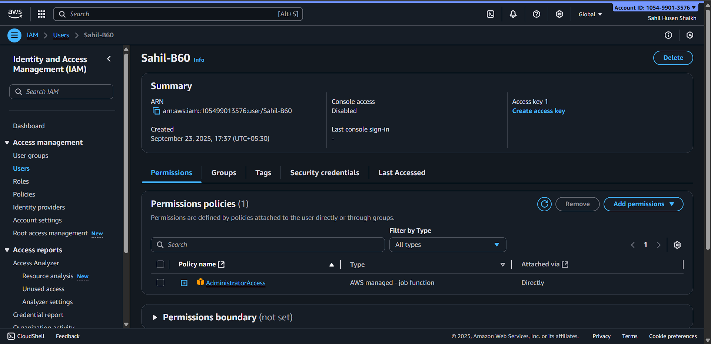
 
- Created new **Access Key** (for CLI)

📸 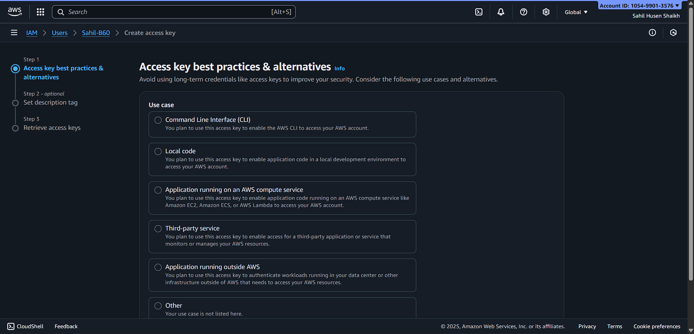
   
- Added description, confirmed, and downloaded `.csv`  

📸 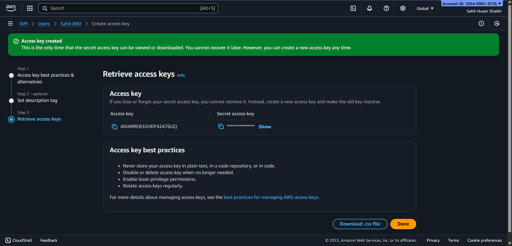

---

### 7️⃣ Configure AWS CLI on Ubuntu
Configured AWS CLI with keys and region:

📸 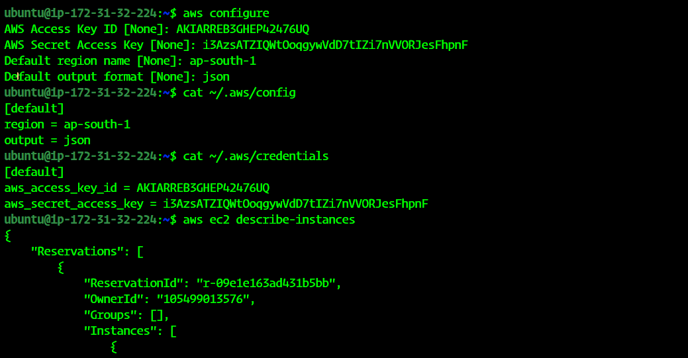

---

### 8️⃣ Verify Setup

Checked EC2 instances via CLI:

aws ec2 describe-instances

---

🎯 Final Outcome

✅ AWS CLI installed on Ubuntu

✅ IAM user created with CLI-only access

✅ Access Key configured

✅ Verified AWS CLI with EC2 command
AWS Secret Access Key
Default region: ap-south-1
Default output format: json
