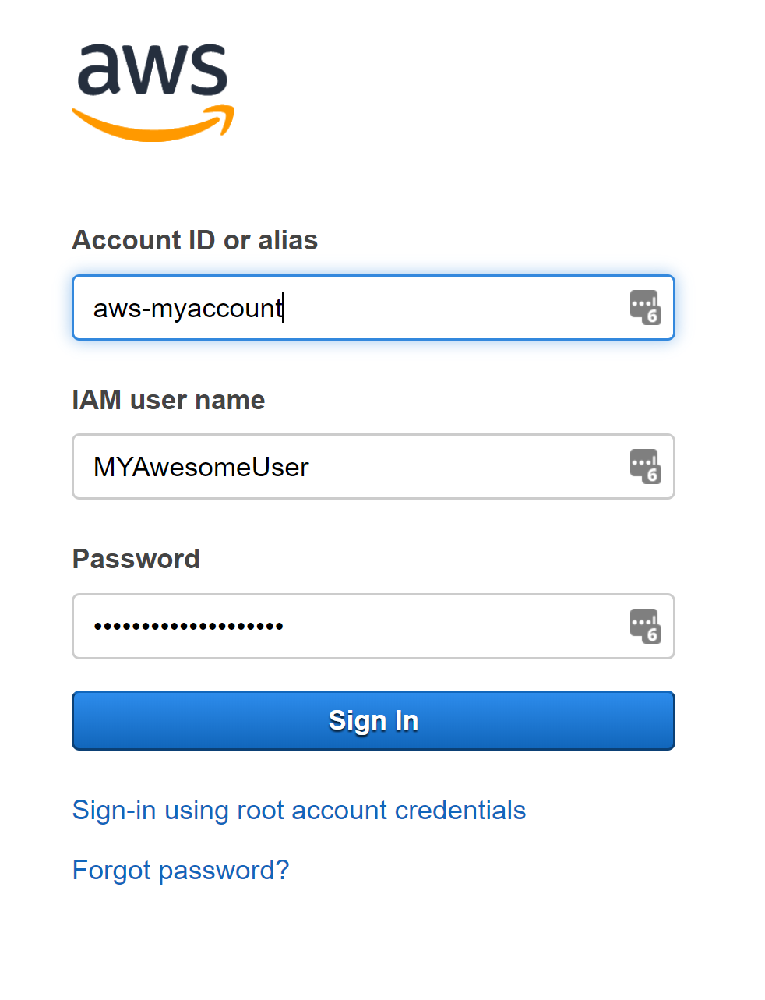
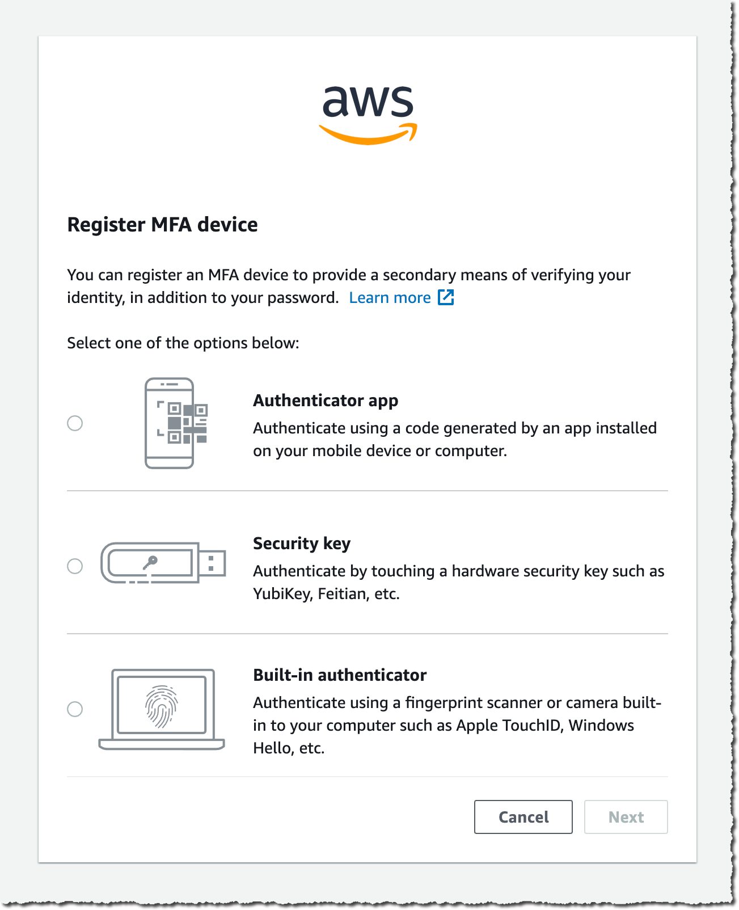
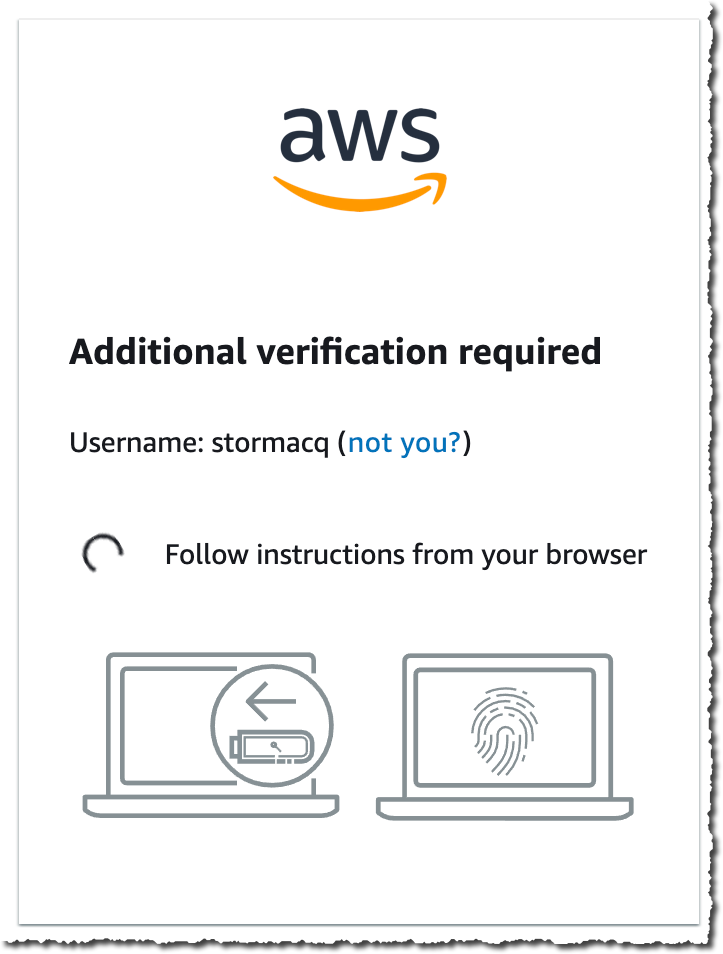
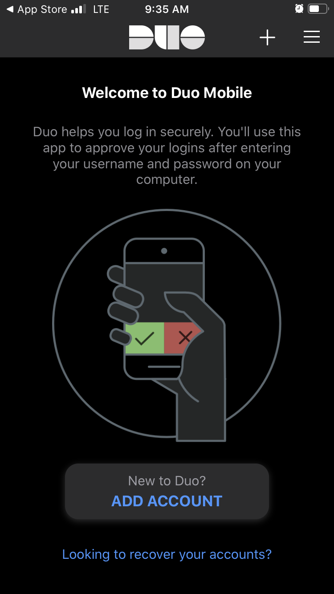
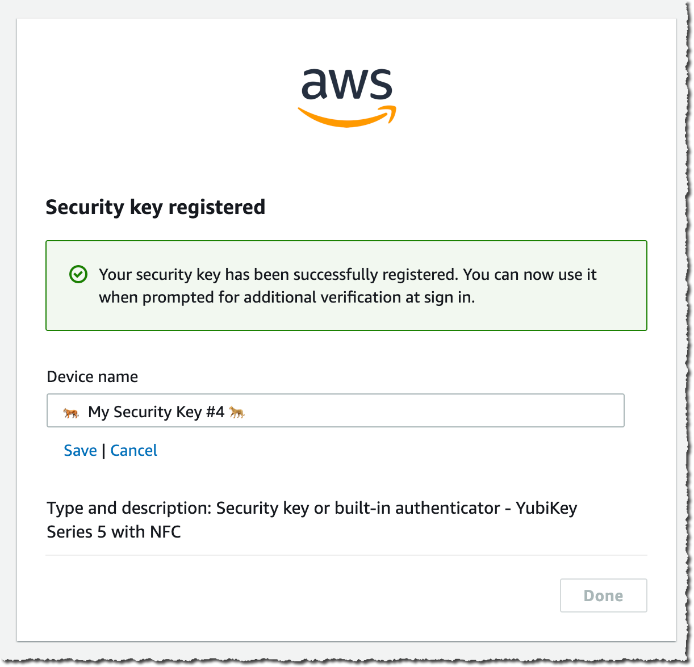
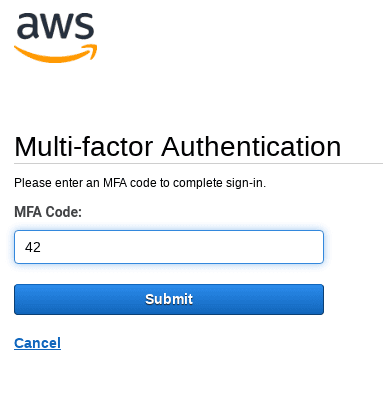

# Task: Enable MFA for IAM User

## Overview
MFA (Multi-Factor Authentication) adds an **extra layer of security** for AWS accounts.  
Even if credentials are compromised, unauthorized access is prevented.  

This task covers:  
- Signing in as IAM user  
- Setting up MFA using mobile app  
- Registering MFA device and testing  

---

## Step 1: Sign in as IAM User
1. Go to **AWS Management Console → IAM → Users**  
2. Click on the **IAM username** you want to enable MFA for  
3. Go to **Security credentials** tab  

---

## Step 2: Start MFA Setup
1. Scroll to **Assigned MFA device → Manage**  
2. Choose **Virtual MFA device**  
3. Click **Continue**  

---

## Step 3: Configure Mobile App
1. Open your **Authenticator app** (Google Authenticator, Authy, etc.) on your mobile  
2. Scan the **QR code** displayed on AWS console  
3. Alternatively, you can **enter the secret key manually** in the app  

---

## Step 4: Register MFA Device
1. Enter **two consecutive MFA codes** from your mobile app  
2. Click **Assign MFA**  
3. AWS confirms device is registered successfully  

---

## Step 5: Test MFA
1. Sign out and sign in again as IAM user  
2. Enter **username and password**  
3. AWS prompts for **MFA code** from your app  
4. Enter code → login successful ✅  

---

## Notes
- Keep backup codes or device secure  
- Use MFA for all sensitive IAM users  
- MFA protects against compromised credentials

