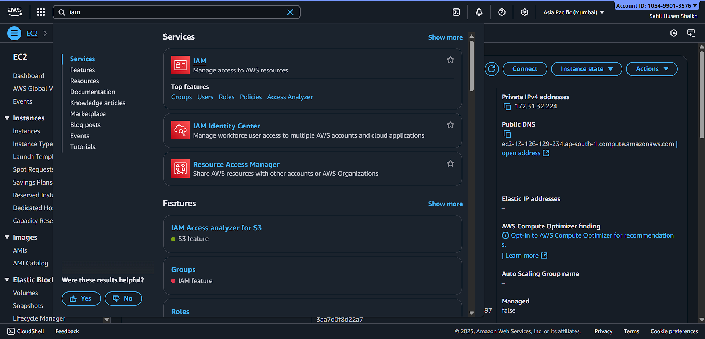
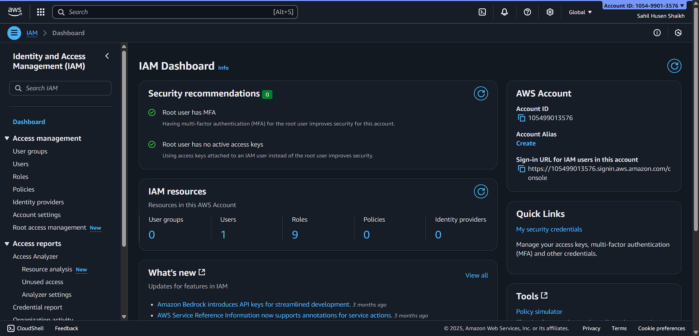
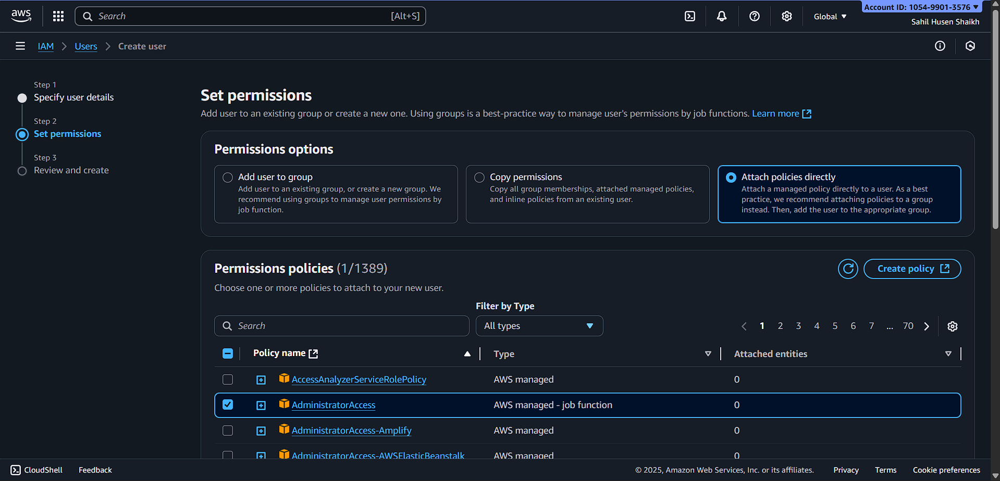
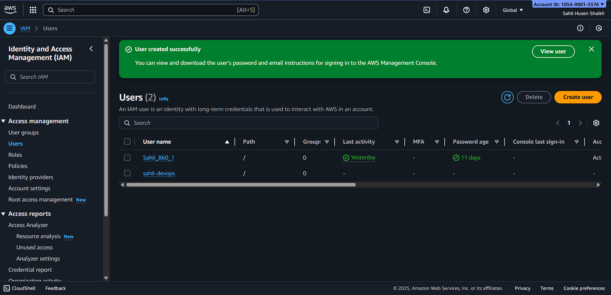
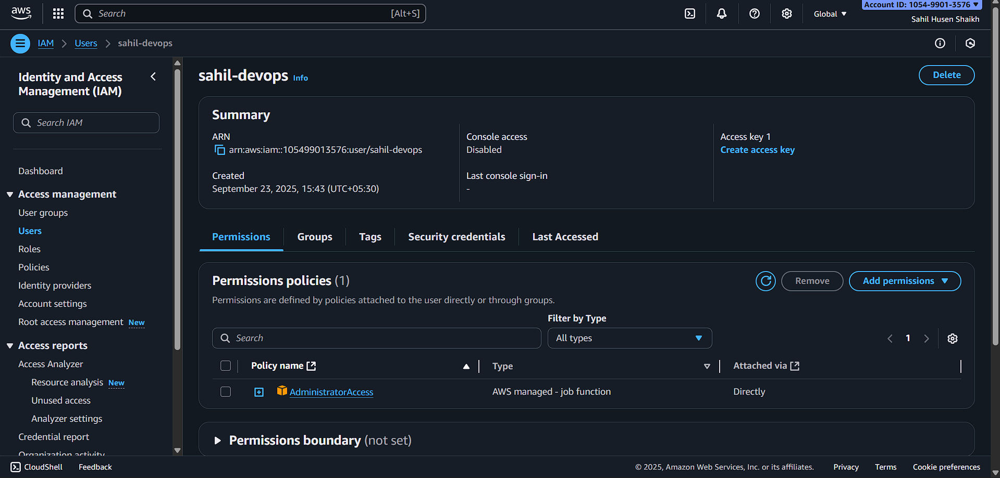
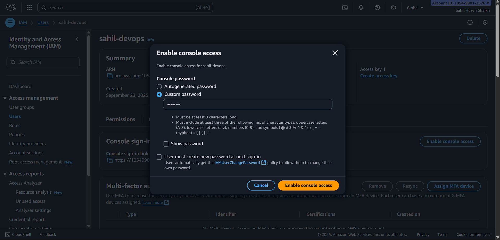
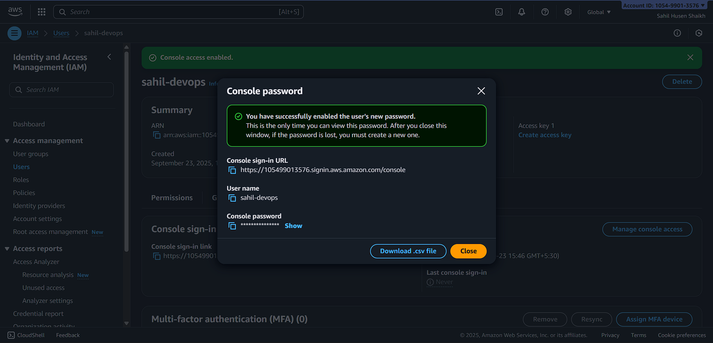
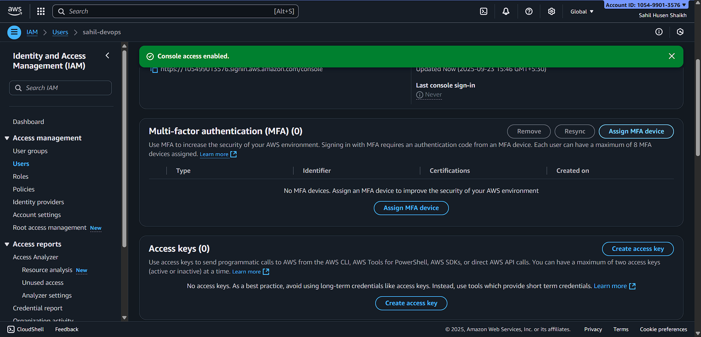
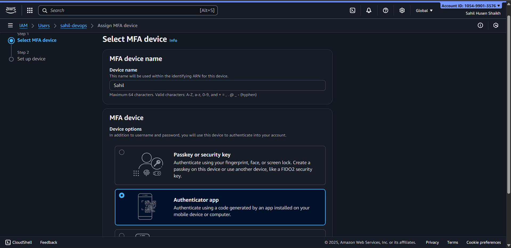
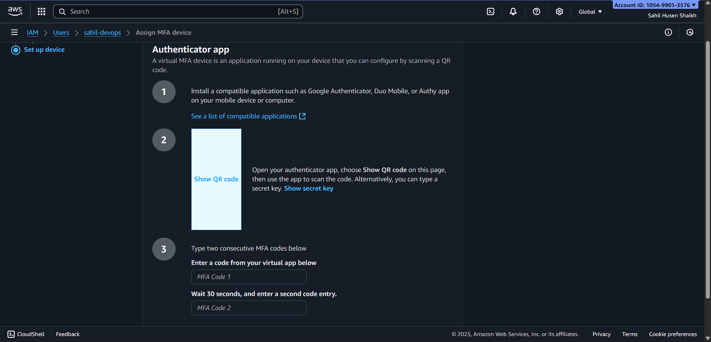

# Task 1: AWS IAM

## Overview
IAM (Identity and Access Management) allows you to control **who can access your AWS account** and **what actions they can perform**.  

This task covers:  
- Searching IAM service  
- Viewing dashboard  
- Managing users  
- Creating new users with permissions  
- Enabling console access and MFA  

---

## Step 1: Search IAM Service
- Go to AWS Console  
- In the search bar, type **IAM** and select the service  

---

## Step 2: IAM Dashboard
- View the IAM dashboard  

---

## Step 3: Users List
- Go to **Users** section to see existing IAM users  

---

## Step 4: Create New User
1. Click **Add user**  
2. Specify username and access type (Programmatic / Console)  

---

## Step 5: Set Permissions
- Attach existing policies or add to a group  
- Choose required permissions for the user  

---

## Step 6: Review User
- Review all settings before creating the user  
- Confirm and create user  

---

## Step 7: Verify User in List
- Check the newly created user in **Users list**  

---

## Step 8: Security Credentials
1. Select user  
2. Go to **Security credentials** tab  
3. View user info, enable console access, and configure MFA  

  
  
  

---

## Notes
- Keep Access Key and Secret Key secure  
- Enable MFA for extra security  
- Follow least privilege principle when assigning permissions
