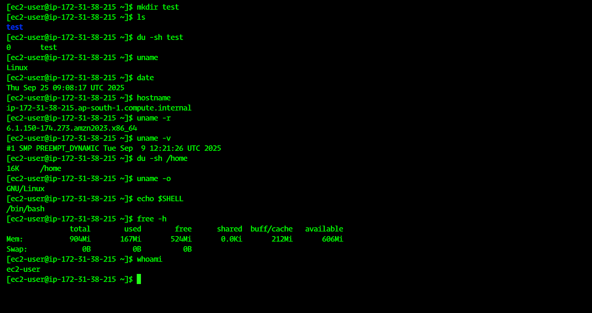

# 🖥️ Linux Task Sheet 1 

## 🔹 Task 1: System Information Commands  

### 1️⃣ Display the kernel name 🧑‍💻  
```bash
uname
```
👉 Prints the kernel name (usually Linux).

---

### 2️⃣ Display the current date and time ⏰  
```bash
date
```
👉 Shows the system date & time.

---

### 3️⃣ Show your machine name 🖥️  
```bash
hostname
```
👉 Displays the system’s hostname.

---

### 4️⃣ Display the version and release of the kernel ⚙️  
```bash
uname -r   # Kernel release
uname -v   # Kernel version
```

---

### 5️⃣ Check the size of a directory 📂  
```bash
du -sh /path/to/directory
```
👉 Example:
```bash
du -sh /home
```
👉 Shows the directory size in human-readable format.

---

### 6️⃣ Display the OS name 🐧  
```bash
uname -o
```
👉 Prints the OS type (e.g., GNU/Linux).

---

### 7️⃣ Print the current running shell 🐚  
```bash
echo $SHELL
```

---

### 8️⃣ Check available memory 💾  
```bash
free -h
```
👉 Shows total, used, and free memory.

---

### 9️⃣ Display the current username 🙋  
```bash
whoami
```
## 🔹 Task 1


--------------------------------------------------------------Created By Sahil Shaikh----------------------------------------------------------------------
