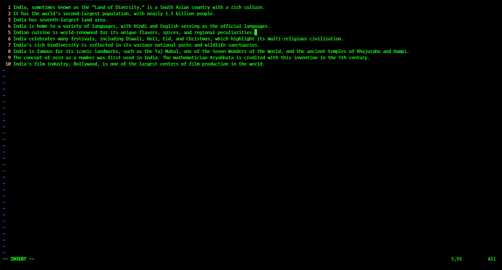
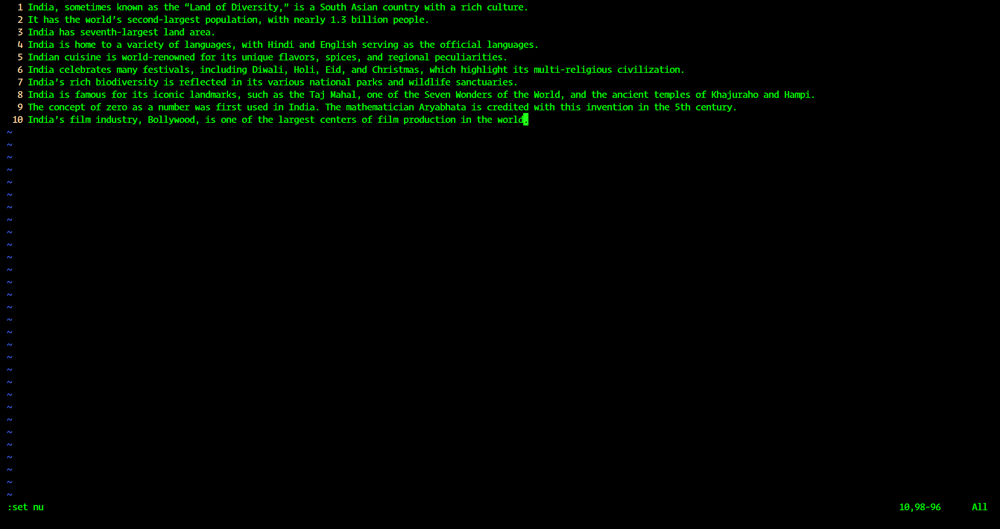
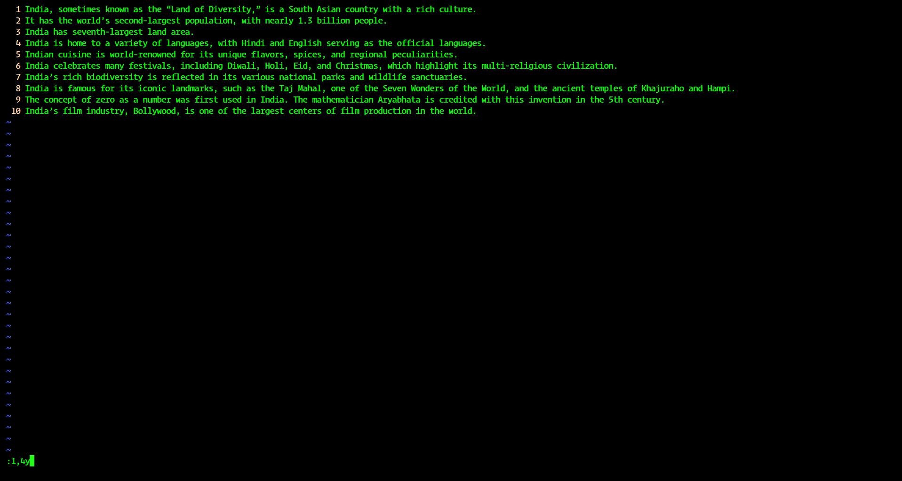
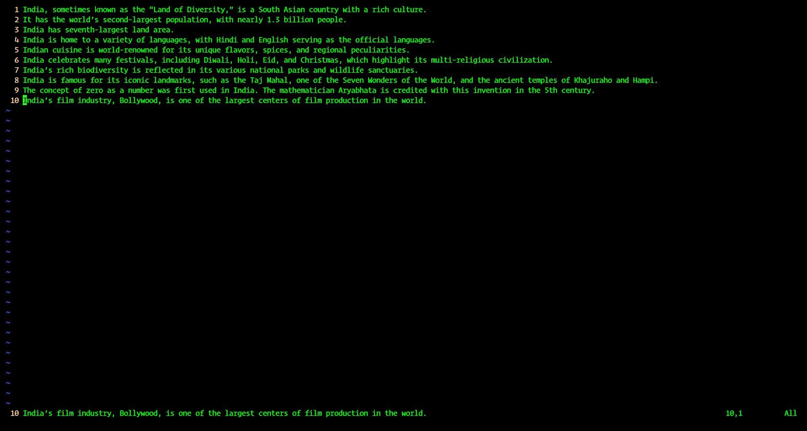
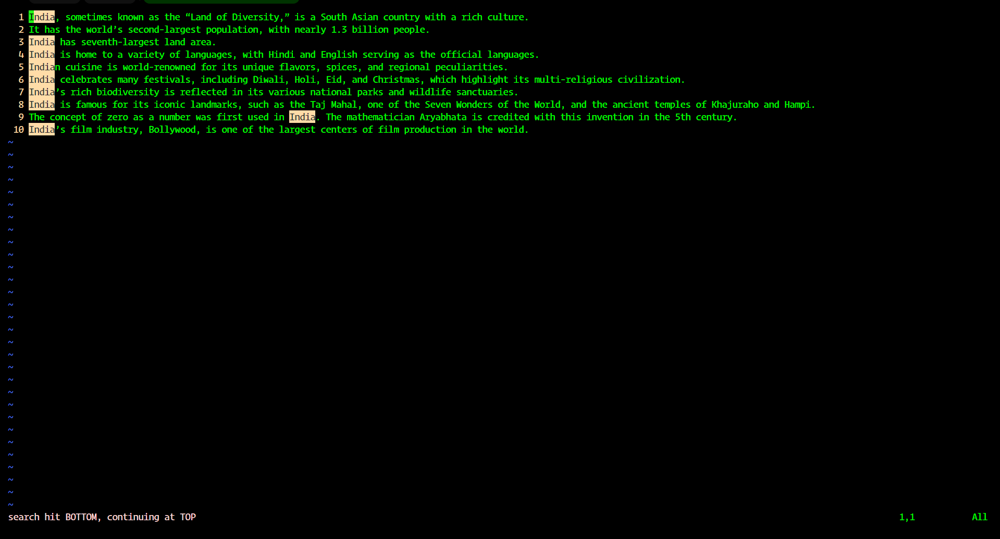
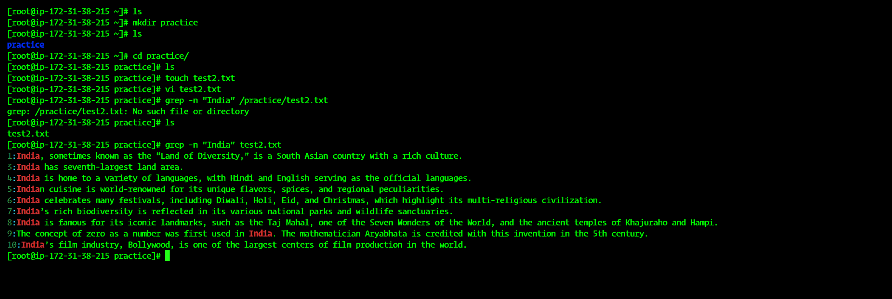
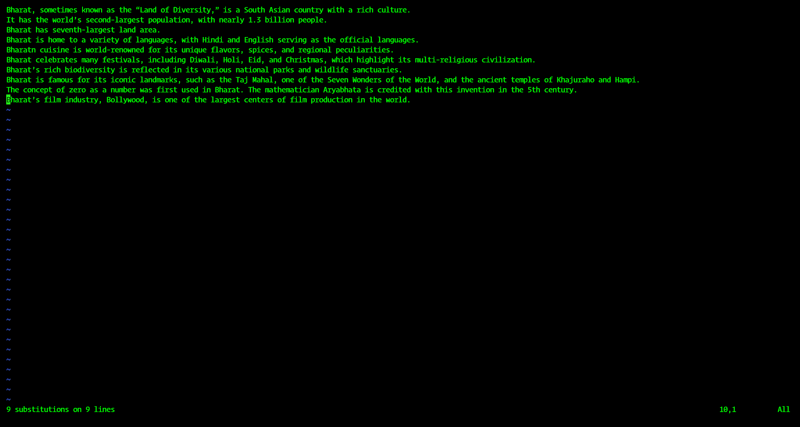
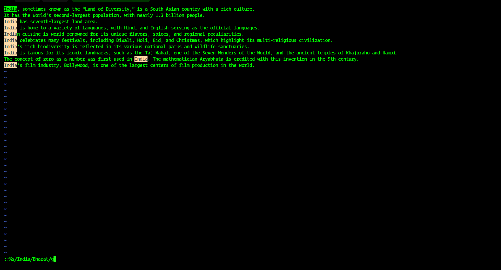
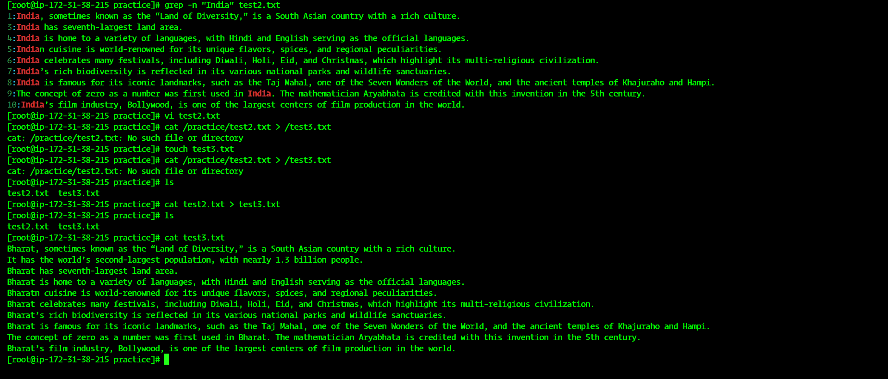

# 🖥️ Linux Task Sheet 2

## 🔹 Task 2: File and Directory Management  

### 1️⃣ Create a directory with the name `/practice` 📂  
```bash
mkdir /practice
```
👉 Creates a new directory called **practice** in the root.  

---

### 2️⃣ Create a file in the `/practice` directory named `task2.txt` 📄  
```bash
touch /practice/task2.txt
```
👉 Empty file named **task2.txt** is created inside `/practice`.  

---

### 3️⃣ Write 10 lines of data in `task2.txt` using the `vi`/`vim` editor ✍️ (topic: *India*)  
```bash
vi /practice/task2.txt
```
👉 Steps inside `vi`:  
- Press `i` → insert mode  
- Write 10 lines about *India*  
- Press `Esc` → `:wq` to save and quit  

---

### 4️⃣ Copy the first 4 lines of the file and paste them at the end 📑  
Inside `vi`:  
```vim
:1,4y   # yank (copy) lines 1 to 4
:$p     # paste them at the end of file
```

---

### 5️⃣ Find the line number where the word *India* appears 🔎  
Inside `vi`:  
```vim
:/India
```
OR in shell:  
```bash
grep -n "India" /practice/task2.txt
```

---

### 6️⃣ Save the file without quitting the editor 💾  
Inside `vi`:  
```vim
:w
```

---

### 7️⃣ Replace the word *India* with *Bharat* 🔄  
Inside `vi`:  
```vim
:%s/India/Bharat/g
```
👉 Replaces all occurrences globally.  

---

### 8️⃣ Save the file without using `wq` ✅  
Inside `vi`:  
```vim
:x
```
OR simply press `Shift + ZZ`.  

---

### 9️⃣ Copy the `task2.txt` file to `/task3.txt` without using the `cp` command 📤  
```bash
cat /practice/task2.txt > /task3.txt
```
👉 Copies content by redirecting output instead of using `cp`.  

---
# 📸 Linux Task Screenshots  

Here are the step-by-step screenshots for the Linux task execution.  

---

## 🔹 Task 1


---

## 🔹 Task 2 - Step by Step  

### 🖼️ Step 2B


### 🖼️ Step 2C


### 🖼️ Step 2D


### 🖼️ Step 2E


### 🖼️ Step 2F


### 🖼️ Step 2G


### 🖼️ Step 2H


### 🖼️ Step 2I


### 🖼️ Step 2J


---

✨ End of screenshots.

--------------------------------------------------------------Created By Sahil Shaikh----------------------------------------------------------------------
