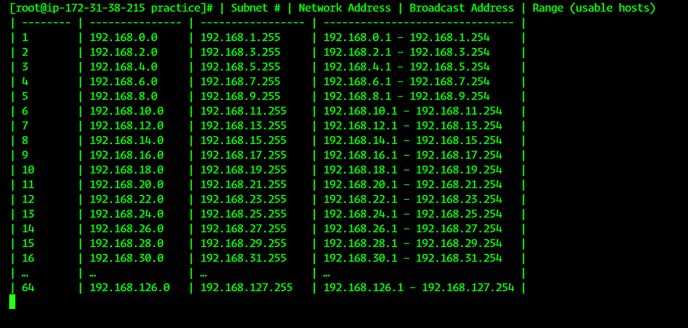

# 🌐 Linux Task Sheet  

## 🔹 Task 4: Networking & Subnetting Task  

### 🔸 IP Range

- 192.168.0.0/17 to 192.168.0.0/23

---

### 1️⃣ Calculate the total number of networks 🧮
- `/17` to `/23` means we are **borrowing 6 bits** (23-17).  
- Total networks = `2^(23-17) = 64`  

---

### 2️⃣ Determine the number of hosts available per subnet 🏠
- Number of host bits = `32 - 23 = 9`  
- Hosts per subnet = `2^9 - 2 = 510`  

---

### 3️⃣ List the subnet ranges for each subnet 📋
| Subnet # | Network Range          |
|-----------|----------------------|
| 1         | 192.168.0.0 - 192.168.1.255 |
| 2         | 192.168.2.0 - 192.168.3.255 |
| 3         | 192.168.4.0 - 192.168.5.255 |
| …         | …                    |
| 64        | 192.168.126.0 - 192.168.127.255 |

👉 Each `/23` subnet has 510 usable hosts.  

---
```
### 📋 Full Subnet Table

| Subnet # | Network Address | Broadcast Address | Range (usable hosts) |
|----------|-----------------|-------------------|----------------------|
| 1 | 192.168.0.0 | 192.168.1.255 | 192.168.0.1 – 192.168.1.254 |
| 2 | 192.168.2.0 | 192.168.3.255 | 192.168.2.1 – 192.168.3.254 |
| 3 | 192.168.4.0 | 192.168.5.255 | 192.168.4.1 – 192.168.5.254 |
| 4 | 192.168.6.0 | 192.168.7.255 | 192.168.6.1 – 192.168.7.254 |
| 5 | 192.168.8.0 | 192.168.9.255 | 192.168.8.1 – 192.168.9.254 |
| 6 | 192.168.10.0 | 192.168.11.255 | 192.168.10.1 – 192.168.11.254 |
| 7 | 192.168.12.0 | 192.168.13.255 | 192.168.12.1 – 192.168.13.254 |
| 8 | 192.168.14.0 | 192.168.15.255 | 192.168.14.1 – 192.168.15.254 |
| 9 | 192.168.16.0 | 192.168.17.255 | 192.168.16.1 – 192.168.17.254 |
| 10 | 192.168.18.0 | 192.168.19.255 | 192.168.18.1 – 192.168.19.254 |
| 11 | 192.168.20.0 | 192.168.21.255 | 192.168.20.1 – 192.168.21.254 |
| 12 | 192.168.22.0 | 192.168.23.255 | 192.168.22.1 – 192.168.23.254 |
| 13 | 192.168.24.0 | 192.168.25.255 | 192.168.24.1 – 192.168.25.254 |
| 14 | 192.168.26.0 | 192.168.27.255 | 192.168.26.1 – 192.168.27.254 |
| 15 | 192.168.28.0 | 192.168.29.255 | 192.168.28.1 – 192.168.29.254 |
| 16 | 192.168.30.0 | 192.168.31.255 | 192.168.30.1 – 192.168.31.254 |
| 17 | 192.168.32.0 | 192.168.33.255 | 192.168.32.1 – 192.168.33.254 |
| 18 | 192.168.34.0 | 192.168.35.255 | 192.168.34.1 – 192.168.35.254 |
| 19 | 192.168.36.0 | 192.168.37.255 | 192.168.36.1 – 192.168.37.254 |
| 20 | 192.168.38.0 | 192.168.39.255 | 192.168.38.1 – 192.168.39.254 |
| 21 | 192.168.40.0 | 192.168.41.255 | 192.168.40.1 – 192.168.41.254 |
| 22 | 192.168.42.0 | 192.168.43.255 | 192.168.42.1 – 192.168.43.254 |
| 23 | 192.168.44.0 | 192.168.45.255 | 192.168.44.1 – 192.168.45.254 |
| 24 | 192.168.46.0 | 192.168.47.255 | 192.168.46.1 – 192.168.47.254 |
| 25 | 192.168.48.0 | 192.168.49.255 | 192.168.48.1 – 192.168.49.254 |
| 26 | 192.168.50.0 | 192.168.51.255 | 192.168.50.1 – 192.168.51.254 |
| 27 | 192.168.52.0 | 192.168.53.255 | 192.168.52.1 – 192.168.53.254 |
| 28 | 192.168.54.0 | 192.168.55.255 | 192.168.54.1 – 192.168.55.254 |
| 29 | 192.168.56.0 | 192.168.57.255 | 192.168.56.1 – 192.168.57.254 |
| 30 | 192.168.58.0 | 192.168.59.255 | 192.168.58.1 – 192.168.59.254 |
| 31 | 192.168.60.0 | 192.168.61.255 | 192.168.60.1 – 192.168.61.254 |
| 32 | 192.168.62.0 | 192.168.63.255 | 192.168.62.1 – 192.168.63.254 |
| 33 | 192.168.64.0 | 192.168.65.255 | 192.168.64.1 – 192.168.65.254 |
| 34 | 192.168.66.0 | 192.168.67.255 | 192.168.66.1 – 192.168.67.254 |
| 35 | 192.168.68.0 | 192.168.69.255 | 192.168.68.1 – 192.168.69.254 |
| 36 | 192.168.70.0 | 192.168.71.255 | 192.168.70.1 – 192.168.71.254 |
| 37 | 192.168.72.0 | 192.168.73.255 | 192.168.72.1 – 192.168.73.254 |
| 38 | 192.168.74.0 | 192.168.75.255 | 192.168.74.1 – 192.168.75.254 |
| 39 | 192.168.76.0 | 192.168.77.255 | 192.168.76.1 – 192.168.77.254 |
| 40 | 192.168.78.0 | 192.168.79.255 | 192.168.78.1 – 192.168.79.254 |
| 41 | 192.168.80.0 | 192.168.81.255 | 192.168.80.1 – 192.168.81.254 |
| 42 | 192.168.82.0 | 192.168.83.255 | 192.168.82.1 – 192.168.83.254 |
| 43 | 192.168.84.0 | 192.168.85.255 | 192.168.84.1 – 192.168.85.254 |
| 44 | 192.168.86.0 | 192.168.87.255 | 192.168.86.1 – 192.168.87.254 |
| 45 | 192.168.88.0 | 192.168.89.255 | 192.168.88.1 – 192.168.89.254 |
| 46 | 192.168.90.0 | 192.168.91.255 | 192.168.90.1 – 192.168.91.254 |
| 47 | 192.168.92.0 | 192.168.93.255 | 192.168.92.1 – 192.168.93.254 |
| 48 | 192.168.94.0 | 192.168.95.255 | 192.168.94.1 – 192.168.95.254 |
| 49 | 192.168.96.0 | 192.168.97.255 | 192.168.96.1 – 192.168.97.254 |
| 50 | 192.168.98.0 | 192.168.99.255 | 192.168.98.1 – 192.168.99.254 |
| 51 | 192.168.100.0 | 192.168.101.255 | 192.168.100.1 – 192.168.101.254 |
| 52 | 192.168.102.0 | 192.168.103.255 | 192.168.102.1 – 192.168.103.254 |
| 53 | 192.168.104.0 | 192.168.105.255 | 192.168.104.1 – 192.168.105.254 |
| 54 | 192.168.106.0 | 192.168.107.255 | 192.168.106.1 – 192.168.107.254 |
| 55 | 192.168.108.0 | 192.168.109.255 | 192.168.108.1 – 192.168.109.254 |
| 56 | 192.168.110.0 | 192.168.111.255 | 192.168.110.1 – 192.168.111.254 |
| 57 | 192.168.112.0 | 192.168.113.255 | 192.168.112.1 – 192.168.113.254 |
| 58 | 192.168.114.0 | 192.168.115.255 | 192.168.114.1 – 192.168.115.254 |
| 59 | 192.168.116.0 | 192.168.117.255 | 192.168.116.1 – 192.168.117.254 |
| 60 | 192.168.118.0 | 192.168.119.255 | 192.168.118.1 – 192.168.119.254 |
| 61 | 192.168.120.0 | 192.168.121.255 | 192.168.120.1 – 192.168.121.254 |
| 62 | 192.168.122.0 | 192.168.123.255 | 192.168.122.1 – 192.168.123.254 |
| 63 | 192.168.124.0 | 192.168.125.255 | 192.168.124.1 – 192.168.125.254 |
| 64 | 192.168.126.0 | 192.168.127.255 | 192.168.126.1 – 192.168.127.254 |

```
---


--------------------------------------------------------------Created By Sahil Shaikh----------------------------------------------------------------------
