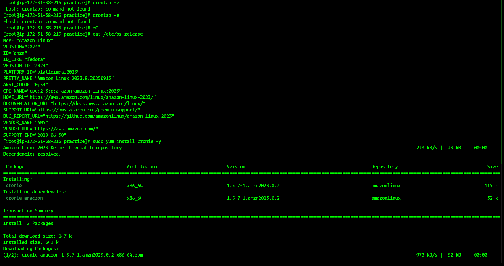
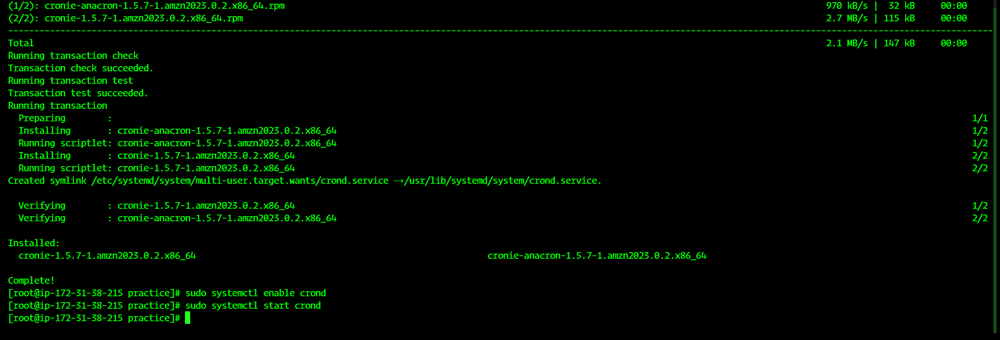
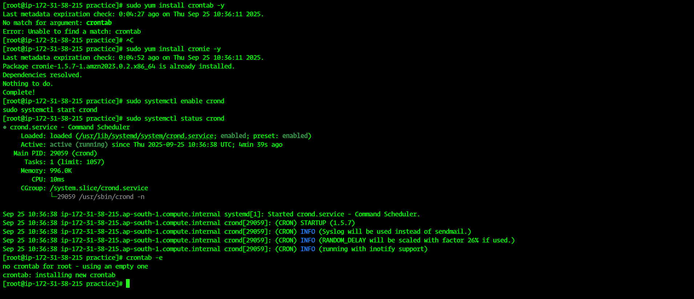
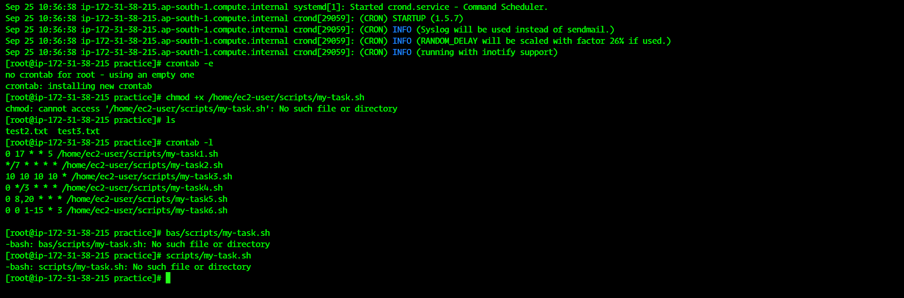

# 🖥️ Linux Task Sheet  

## 🔹 Task 5: Cron Jobs (Scheduled Tasks) ⏰  

Cron is a **time-based job scheduler in Linux**.  
It allows you to run scripts or commands automatically at specified times or intervals.  

- Cron jobs are managed using the `crontab` command.  
- Each user can have their own crontab.  
- The cron service must be running for jobs to execute:
  
```bash
sudo systemctl status cron    # Ubuntu/Debian
sudo systemctl status crond   # CentOS/RHEL
````

---

### 🔹 Cron Syntax

A cron job has **5 fields + command**:

```
* * * * * command_to_run
- - - - -
| | | | |
| | | | ----- Day of week (0 - 7) (Sunday=0 or 7)
| | | ------- Month (1 - 12)
| | --------- Day of month (1 - 31)
| ----------- Hour (0 - 23)
------------- Minute (0 - 59)
```

💡 Example:

```bash
30 14 * * * /home/user/backup.sh
```

* Runs `/home/user/backup.sh` every day at **14:30 (2:30 PM)**

---

## ✅ Cron Jobs Tasks

### 1️⃣ Run a task **every Friday at 5 PM** 📅

```bash
0 17 * * 5 /path/to/script.sh
```

Explanation:

* `0` → minute 0
* `17` → hour 17 (5 PM)
* `* *` → every day of month & every month
* `5` → Friday

---

### 2️⃣ Run a task **every 7 minutes** ⏱️

```bash
*/7 * * * * /path/to/script.sh
```

Explanation:

* `*/7` → every 7 minutes
* `* * * *` → any hour, day, month, weekday

---

### 3️⃣ Run a task **on October 10th at 10:10 AM** 📌

```bash
10 10 10 10 * /path/to/script.sh
```

Explanation:

* `10` → minute 10
* `10` → hour 10 (10 AM)
* `10` → day 10
* `10` → October (month 10)
* `*` → any day of week

---

### 4️⃣ Run a task **every 3 hours** ⏳

```bash
0 */3 * * * /path/to/script.sh
```

Explanation:

* `0` → minute 0
* `*/3` → every 3 hours (0,3,6,9,12,15,18,21)
* `* * *` → every day, every month, every weekday

---

### 5️⃣ Run a task **twice a day at 8 AM and 8 PM** 🌅🌃

```bash
0 8,20 * * * /path/to/script.sh
```

Explanation:

* `0` → minute 0
* `8,20` → at 8 AM and 8 PM
* `* * *` → every day, every month, every weekday

---

### 6️⃣ Run a task **every Wednesday between the 1st and 15th of the month** 📆

```bash
0 0 1-15 * 3 /path/to/script.sh
```
---
Explanation:

* `0 0` → midnight
* `1-15` → days 1 to 15 of the month
* `*` → any month
* `3` → Wednesday (0=Sun, 1=Mon,...3=Wed)

---

### 🔹 Manage Cron Jobs
---
1. **Edit current user cron jobs**

```bash
crontab -e
```

* Opens the crontab file in default editor (vi/vim/nano).
---
2. **List cron jobs**

```bash
crontab -l
```
---
3. **Remove all cron jobs**

```bash
crontab -r
```
---
4. **Run cron logs**

* Logs are stored in `/var/log/syslog` (Ubuntu) or `/var/log/cron` (RHEL/CentOS).

```bash
grep CRON /var/log/syslog
```
---
### Screenshots 

📸 Step 1: 

📸 Step 2: 

📸 Step 3: 

📸 Step 4: 

---

✅ **Cron Jobs Task Completed!** 🚀

💡 Tip: Always test your script manually first before adding to cron to avoid errors.


-------------------------------------------------------Created By Sahil Shaikh---------------------------------------------------------------------------
