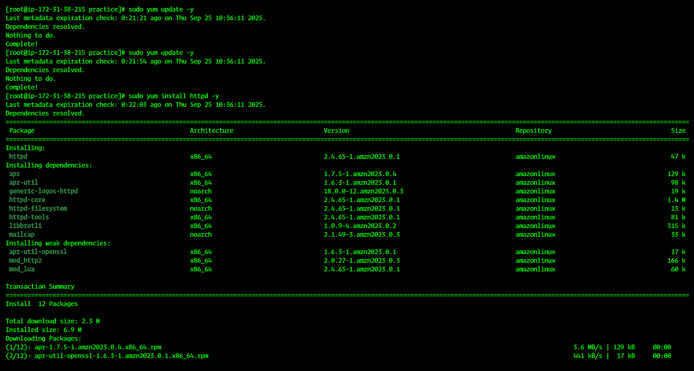
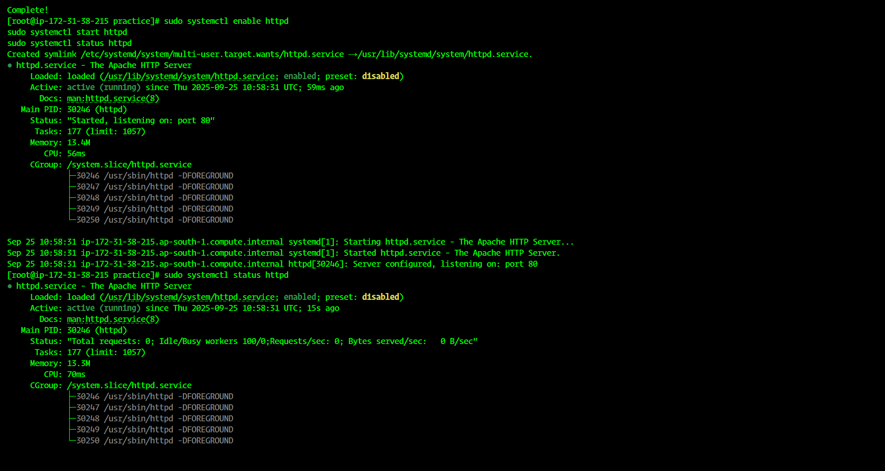
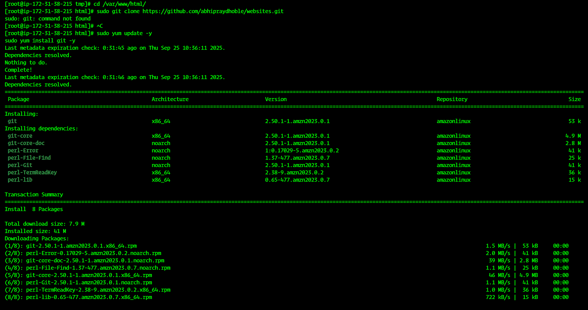
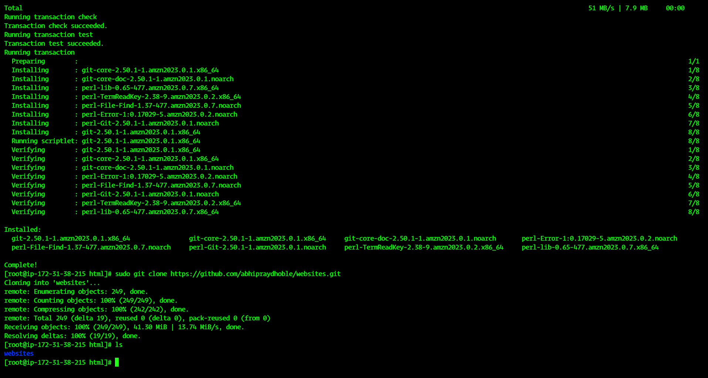
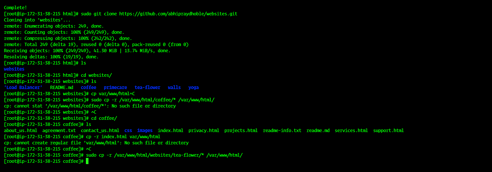
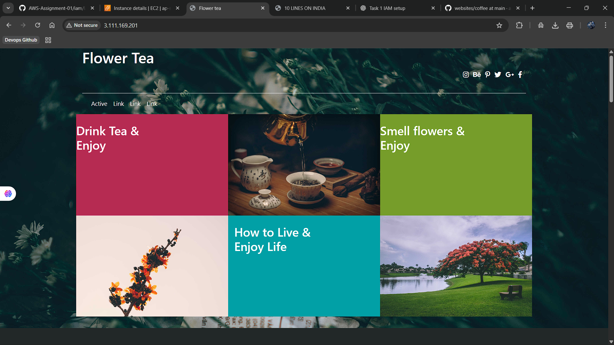
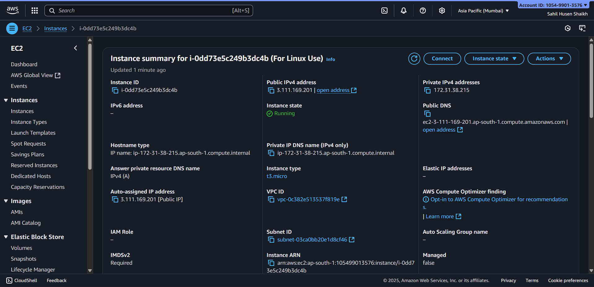

# 🌐 Web Hosting using Apache (HTTPD) & GitHub Template.
---

### ✅ Step 1: Install Apache (HTTPD)

# For Amazon Linux / RHEL / CentOS

```
sudo yum install httpd -y
```
---

# Enable and Start service
```
sudo systemctl enable httpd
sudo systemctl start httpd
```
---

## ✅ Step 2: Install Git (if not installed)

```
sudo yum install git -y
```
---

## ✅ Step 3: Clone Template from GitHub

```
cd /var/www/html/
sudo git clone https://github.com/abhipraydhoble/websites.git
```
---

# 📂 Now inside /var/www/html/websites/ you will see multiple templates like:

```
coffee/   yoga/   tea-flower/   primecare/   walls/   Load Balancer/
```
---

## ✅ Step 4: Copy Template Files to Web Root (Single Website Hosting)

- Example: Hosting coffee website
```
cd /var/www/html/websites/coffee/
sudo cp -r * /var/www/html/
```
---

## ✅ Step 5: Restart Apache
```
sudo systemctl restart httpd
```
---

## ✅ Step 6: Test in Browser

- Open your EC2 Public IP in browser:
  
```
http://<your-ec2-public-ip>/
```

👉 You should see your hosted template (Coffee website 🎉)

☕ Hosting Multiple Websites with Apache Virtual Hosts

---
### If you want to host coffee site + yoga site separately:
---
Step 1: Create Directories

```
sudo mkdir -p /var/www/coffee
sudo mkdir -p /var/www/yoga
```
Step 2: Copy Files

```
sudo cp -r /var/www/html/websites/coffee/* /var/www/coffee/
sudo cp -r /var/www/html/websites/yoga/* /var/www/yoga/
```
Step 3: Create Virtual Host Config Files

```
sudo nano /etc/httpd/conf.d/coffee.conf
```

- Add this:
```
<VirtualHost *:80>
    ServerName coffee.local
    DocumentRoot /var/www/coffee
</VirtualHost>
```
---
```
sudo nano /etc/httpd/conf.d/yoga.conf
```
---

- Add this:
```
<VirtualHost *:80>
    ServerName yoga.local
    DocumentRoot /var/www/yoga
</VirtualHost>
```
---
Step 4: Restart Apache
```
sudo systemctl restart httpd
```
Step 5: Update Local Hosts File (for testing without domain)

- On your system (not EC2):
```
sudo nano /etc/hosts
```

- Add:
  
```
<EC2-PUBLIC-IP> coffee.local
<EC2-PUBLIC-IP> yoga.local
```

## ✅ Now open in browser:

```
http://coffee.local → Coffee website
```
---
```
http://yoga.local → Yoga website
```
## 📸 Screenshots 

# 📸 Web Hosting Steps – Screenshots  

## 🔹 Step 1 – Install & Start HTTPD  
  

---

## 🔹 Step 2 – Navigate to `/var/www/html/`  
  

---

## 🔹 Step 3 – Clone Website Template from GitHub  
  

---

## 🔹 Step 4 – Explore Cloned Repo  
  

---

## 🔹 Step 5 – Copy Template Files into `/var/www/html/`  
  

---

## 🔹 Step 6 – Verify Files Inside Apache Root  
  

---

## 🔹 Step 7 – Access Website via Browser (Public IP)  
  

---
### 📂 Folder Structure (After Setup)

```
/var/www/
├── html/                     <-- Default Apache root
│   └── index.html            <-- Hosted single site (coffee etc.)
│
├── websites/                 <-- GitHub cloned repo
│   ├── coffee/
│   │   ├── index.html
│   │   ├── css/
│   │   ├── images/
│   │   └── ...
│   ├── yoga/
│   │   ├── index.html
│   │   ├── css/
│   │   ├── js/
│   │   └── ...
│   ├── tea-flower/
│   └── ...
│
├── coffee/                   <-- For Virtual Host 1
│   ├── index.html
│   ├── css/
│   └── images/
│
└── yoga/                     <-- For Virtual Host 2
    ├── index.html
    ├── css/
    └── js/
```

### ⚡ Pro Tips:

- Use a2ensite style management on Ubuntu/Debian.

- Add SSL with Certbot for HTTPS.

- Use custom domains with Route53 / DNS for production.

--------------------------------------------------------------Created By Sahil Shaikh----------------------------------------------------------------------
