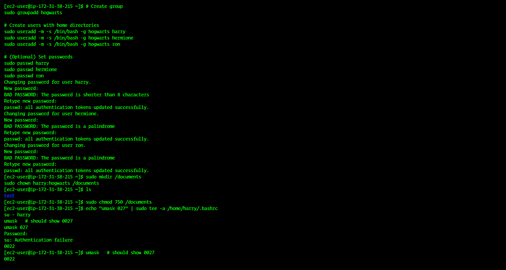
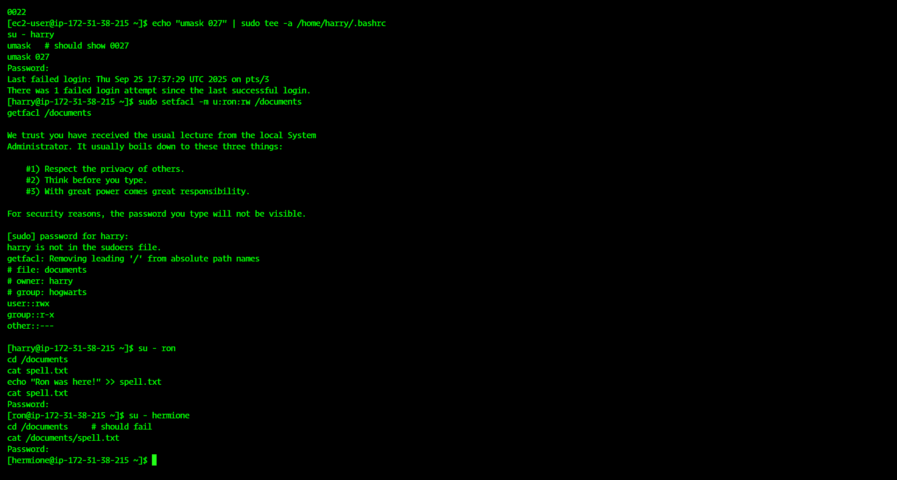

# 🧙‍♂️ File Permissions & ACL – Hogwarts Practice  

## 📌 Overview  
In this task, we configure **Linux users, groups, permissions, and ACLs** to control access on a shared directory.  

We’ll create the **hogwarts** group and assign users:  
- 🧑‍🎓 `harry` (Owner)  
- 🧑‍🎓 `hermione` (Group Member)  
- 🧑‍🎓 `ron` (Group Member with special ACL)  

---

## 🪜 Step-by-Step Guide  

### 1️⃣ Create Group & Users  
```bash
# Create group
sudo groupadd hogwarts

# Create users with home directories
sudo useradd -m -s /bin/bash -g hogwarts harry
sudo useradd -m -s /bin/bash -g hogwarts hermione
sudo useradd -m -s /bin/bash -g hogwarts ron

# (Optional) Set passwords
sudo passwd harry
sudo passwd hermione
sudo passwd ron
```
---

### 2️⃣ Create `/documents` Directory  
```bash
sudo mkdir /documents
sudo chown harry:hogwarts /documents
```
---

### 3️⃣ Set Permissions `rwxr-x---`  
```bash
sudo chmod 750 /documents
```
✔️ Owner → `rwx`  
✔️ Group → `r-x`  
✔️ Others → `---`  

---

### 4️⃣ Configure `umask` for Harry  
Ensure all new files created by Harry inside `/documents` have `rw-r-----`.  

```bash
echo "umask 027" | sudo tee -a /home/harry/.bashrc
su - harry
umask   # should show 0027
```
---

### 5️⃣ Set ACL for Ron  
Give Ron explicit write access even though default group perms are read-only.  

```bash
sudo setfacl -m u:ron:rw /documents
getfacl /documents
```
---

### 6️⃣ Create File as Harry  
```bash
su - harry
cd /documents
echo "Magic is might!" > spell.txt
ls -l
```
---

### 7️⃣ Verify Ron’s Access  
```bash
su - ron
cd /documents
cat spell.txt
echo "Ron was here!" >> spell.txt
cat spell.txt
```
✅ Ron can **read and modify** the file.

---

### 8️⃣ Verify Hermione’s Access  
```bash
su - hermione
cd /documents     # should fail
cat /documents/spell.txt
```
❌ Hermione cannot access the file.

📸 

📸 

---

## 🎯 Final Outcome  
- ✅ Hogwarts group created with users `harry`, `hermione`, `ron`.  
- ✅ Directory `/documents` with owner `harry` and group `hogwarts`.  
- ✅ Permissions enforced: `rwxr-x---`.  
- ✅ Umask ensures files = `rw-r-----`.  
- ✅ Ron granted write access via ACL.  
- ✅ Hermione blocked from accessing files.  

✨ Access control achieved successfully using **Linux Permissions + ACL**!  

--------------------------------------------------------------Created By Sahil Shaikh----------------------------------------------------------------------
